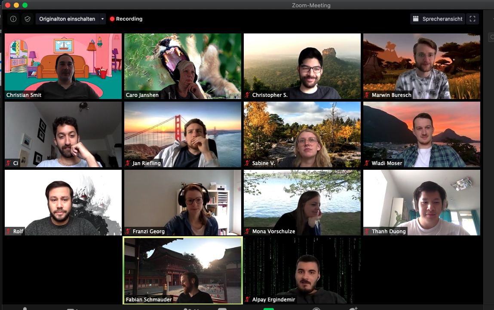
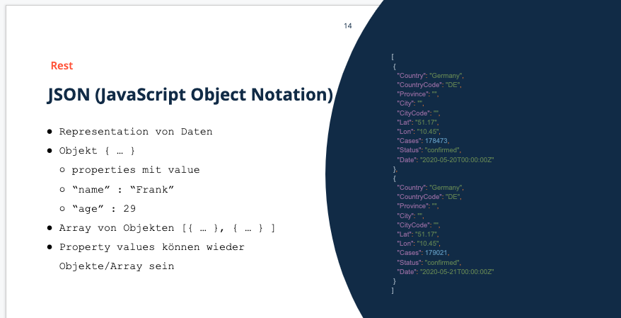
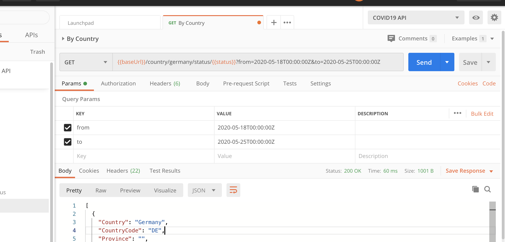
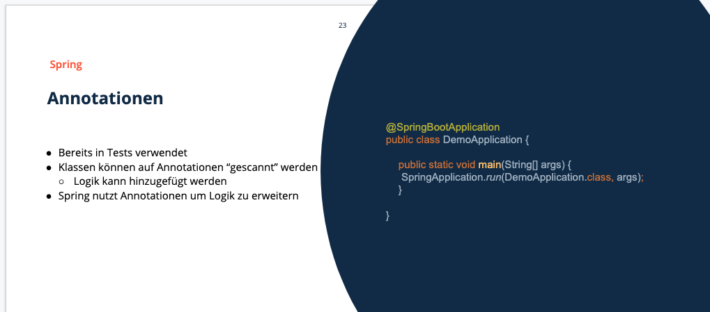
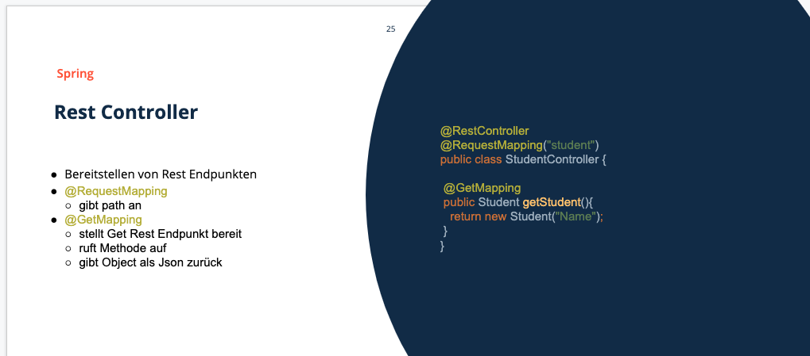
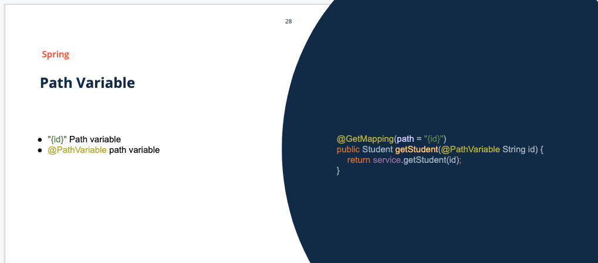

# 25.05.2020, Montag

### 9:00 Uhr - Start Week3 Day1

## Anwesenheit 

(Rolf kam etwas später, daher nicht aus dem Bild)

## Tagesablauf

- 09:00 Uhr: wunderschöne Gesangseinlage
- 09:05 Uhr: Review der letzten Woche
- 09:10 Uhr: Besprechung Freitagsaufgabe
- 10:45 Uhr: 15-Min-Pause
- 11:20 Uhr: Webanwendung/Einleitung REST
- 11:50 Uhr: Postman
- 12:35 Uhr: Spring
- 13:00 Uhr: Mittagspause
- 14:00 Uhr: Spring Webprojekt aufsetzen
- 15:00 Uhr: post/put resource
- 15:20 Uhr: REST Controller get/put Endpunkt
- 16:40 Uhr: 404 exception

## Besprechung Freitagsaufgabe
### tips and tricks
siehe zoom-record für vollständige Beispiellösung.

- grundsätzliche Empfehlung für das Herangehen an komplexere Aufgabenstellungen: Github Issues nutzen, um diese dann abarbeiten zu können und die jeweiligen Steps dann portionsweise committen zu können und/oder in der MainMethode vorab die nötigen steps einkommentieren
- Verschlankung der MainMethode durch Auslagern von Methoden
- Verhinderung des Zugriffs auf die interne Datenstruktur in der Main durch Nutzung von collections-Hilfsmethoden wie etwa ".unmodifiable".
- "OrderService" wird erstellt, um Abhängigkeiten innerhalb der Datenbanken zu vermeiden. Zudem wird hier die businesslogic geprüft/ausgeführt.
- für den Umstand, dass zwei orders auch unterschiedliche IDs haben sollen, kann UUID (Universally Unique Identifier) genutzt werden. Dadurch wird eine random ID erzeugt, die Wahrscheinlichkeit auf zwei identische IDs ist äußerst gering.
- da in Nr. 6 für die .get als Rückgabewert ein Optional genutzt werden soll, kann man über Rechtsklick->find Usages (z.B. auf "Product" in der ProductDB) die Anpassung schnell vornehmen und übersieht keine Einsatzpunkte. 
- die Tests für Nr. 7 mit try/catch schreiben und nach dem try ein fail() einbauen. Damit ist sichergestellt, dass der Test die exception auch wirklich fängt (ansonsten wäre in unserem Beispiel der Test auch bei nicht existenten Produkten grün).

### Webanwendung 
Bislang haben wir ausschließlich im Backend gearbeitet, ohne Möglichkeit der Kommunikation nach außen. Dies geschieht in einer Webanwendung über sog. requests/responses zwischen Backend und Browser.

Beispiel: Der Browser (Client) sendet durch den Aufruf einer URL des Webservers eine request an diesen Webserver (Backend). Der Webserver nimmt die Anfrage entgegen und übergibt sie an die Webanwendung. Diese erzeugt/lädt den HTML-Quellcode der Webseite, welcher dann vom Webserver zurück zum Browser geschickt wird (response). In von Chrome zur Verfügung gestellten Devtools kann man z.B. über den Tab "Network" den Datenfluss und die erstellten requests einsehen.
   

## REST
### Bedeutung
REST (REpresentational State Transfer) ist ein Programmierparadigma (gängiger Programmierstil) für Webservices und ein Standard, um im WWW zu kommunizieren. REST als Architekturstil nutzt bereits vorhandene Technologien und Protokolle des Internets, wie HTTP und JSON. Eine RESTful API ist eine Programmierschnittstelle, die HTTP-Befehle verwendet, um in Webservices mit Aufforderungen wie GET, PUT, POST und DELETE auf Daten zuzugreifen.

Aufruf einer URL( = Uniform Resource Location) mit

- Get (Abfrage einer resource)

- Post (Hinzufügen einer ressource)

- Put (Ändern/Hinzufügen einer ressource)

- Delete (Löschen einer ressource)

Nach dem request kommt der Body zurück, der die Daten sendet (meist nur bei Post und Put).
Der Header gibt Zusatzinformationen mit, z.B. Authorization. 

Am häufisten wird über JSON (JavaScript Object Notation) kommuniziert. Bei JSON handelt es sich um ein Textformat zum Austausch von Daten. Es werden verschiedene Elemente unterschieden. Diese sind Objekte, Arrays, Zahlen, Boolesche Werte oder Strings. Zentrale Bestandteile sind die sogenannten "Schlüssel : Wert"-Paare und Satzzeichen wie runde und geschweifte Klammern, Doppelpunkte und Semikolon.  

### Anwendungsbeispiel
Angenommen, jemand möchte eine Desktopanwendung erstellen, die es ermöglicht Nachrichten und Posts via Twitter zu versenden. Hierfür benötigt er die von Twitter bereitgestellte API und kann sie dank REST und standardisierten HTTP- oder JSON-Anfragemethoden mit relativ wenig Aufwand in sein eigenes Programm implementieren.

## Postman

#### Was ist eine API?
API steht für application programming interface (Schnittstelle zur Anwendungsprogrammierung). Mittels einer API kann z.B. eine Software in ein anderes System eingebunden werden. Damit ein Programm die Funktionalitäten einer anderen Software aufrufen und nutzen kann, muss dieses die entsprechende API implementieren. Damit können unterschiedliche Softwaremodule / Programmteile (services) unabhängig voneinander erstellt werden, die über eine Schnittstelle kommunizieren. Der Vorteil einer solchen modularen Programmierung liegt darin, dass Software einfacher gewartet und durch zusätzliche Module individuell erweitert werden kann. Mittels API kann man relativ schnell eine Anwendung bereitstellen, da man die API lediglich ans eigene Projekt anbinden muss. Die API Dokumentation liefert die Detailinfos, z.B. woher die API wiederum ihre Daten bezieht oder welche Nutzungsbedingungen gelten. 

### Erklärung zu Postman
Postman ist eine Entwicklungsumgebung zum Ausführen, Testen und Dokumentieren von REST APIs. Alternativ können Daten auch via curl - ein Befehlszeilentool zum Übertragen von Daten mittels URL - gesendet werden. Mit Postman muss der curl request nicht selber geschrieben werden. 

## Spring
### Erklärung
Das Spring Framework (kurz Spring) ist ein quelloffenes Framework für die Java-Plattform, welches oft für Web-Anwendungen verwendet wird. Ziel des Spring Frameworks ist es, die Entwicklung mit Java/Java EE zu vereinfachen und gute Programmierpraktiken zu fördern. Spring bietet mit einem breiten Spektrum an Funktionalität eine ganzheitliche Lösung zur Entwicklung von Anwendungen und deren Geschäftslogiken; dabei steht die Entkopplung der Applikationskomponenten im Vordergrund. Spring setzt auf Aspekt-orientierte Programmierung (Trennung von Geschäftslogik und Funktionalität) und bietet riesige Bibliotheken von Modulen (z.B. LDAP, Mongo).

#### Spring Initializr
Dieser vereinfacht das Aufsetzen eines neues Projekts. Er ist bereits in IntelliJ eingebunden. 

#### Annotationen

### Spring Web
#### Annotation "Rest Controller"

Rest Controller sind im Spring Boot Umfeld Java Klassen, die mit speziellen Annotationen angereichert werden. Um eine einfache Java Klasse zu einem Rest Controller zu deklarieren ist es ausreichend, dass die Klasse mit „@RestController“ notiert wird.

#### Post/Put rescource

- @PostMapping: fügt post rest Endpunkt hinzu
- @PutMapping: fügt put rest Endpunkt hinzu
- @RequestBody: Daten im RequestBody 

Für die post/put resource bietet sich Postman an, da darüber sehr einfach zu realisieren. 

#### Path Variable

Diese Annotation ermöglicht die Bindung eines einzelnen Methodenparameters an eine URL (z.B. einzelne Studenten aus der Studentenliste per ID im Browser aufzurufen).

#### 404-exception
Der HTTP-Fehler 404 bedeutet, dass die Seite, die geöffnet werden sollte, nicht auf dem Server gefunden werden konnte. Diese Meldung sollte im Controller eingebunden werden, da ansonsten eine leere Seite ausgegeben wird, die keinerlei Informationen zur Fehlerursache liefert (z.B. falls, wie unserem Beispiel, eine Studenten-ID aufgerufen wird, die gar nicht existiert).

### Anwendungsbeispiel (StudentController)

 
 @RestController
 @RequestMapping("dumbo/heidi")
 
 public class StudentController {
 
     ArrayList<Student> listOfStudents = new ArrayList<>();
 
     public StudentController() {
         listOfStudents.add(new Student("Helene", 22, "8"));
         listOfStudents.add(new Student("Dieter", 31, "34"));
         listOfStudents.add(new Student("Jürgen", 24, "4"));
         listOfStudents.add(new Student("Ingeborg", 22, "39"));
         listOfStudents.add(new Student("Detlev", 30, "65"));
 
     }
 
     @GetMapping("whatever")
     public ArrayList<Student> getStudents() {
 
         return listOfStudents;
 
     }
 
     @PutMapping
     public Student addAStudent(@RequestBody Student someStudent) {
         listOfStudents.add(someStudent);
         return someStudent;
     }
 
     @GetMapping("{id}")
     public Student showStudentByID(@PathVariable String id) {
         for (Student hippies : listOfStudents) {
             if (hippies.getId().equals(id)) {
                 return hippies;
 
             }
         }
         throw new ResponseStatusException(HttpStatus.NOT_FOUND, "student not found");
 
     }

Die Ausgabe der Studentenliste im Browser erfolgt hier unter der URL http://localhost:8080/dumbo/heidi/whatever

localhost steht für die IP Adresse "127.0.0.1", die auf den Server auf dem eigenen Rechner referiert. 

### Host in use
Falls kann nach einem Neustart des lokalen Servers die Fehlermeldung darauf verweist, dass der host "in use" ist:
- im Terminal eingeben: lsof -i :8080
- PID auslesen
- im activity log den entsprechenden Prozess löschen --> "der Gerät" geht wieder! :)

### Lombok
Lombok ist das Framework der Wahl für den Fauli-Entwickler von heute. Das wiederholte Schreiben von Gettern, Settern und anderen Lästigkeiten nimmt einem Lombok dankenswerterweise ab. Dies geschieht durch Generierung des notwendigen Codes zur Compilezeit. 

Ein Auszug der möglichen Annotationen:

- @Getter
- @Setter
- @ToString
- @EqualsAndHashCode
- @AllArgsConstructor
- @NoArgsConstructor
- @NonNull

#### Resources

-  Documentation and Test Consoles for over 1400 public APIs: https://any-api.com/
