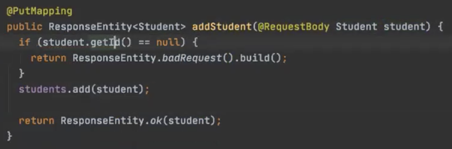
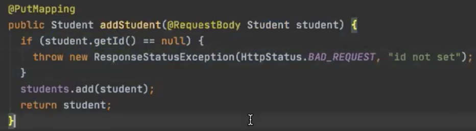
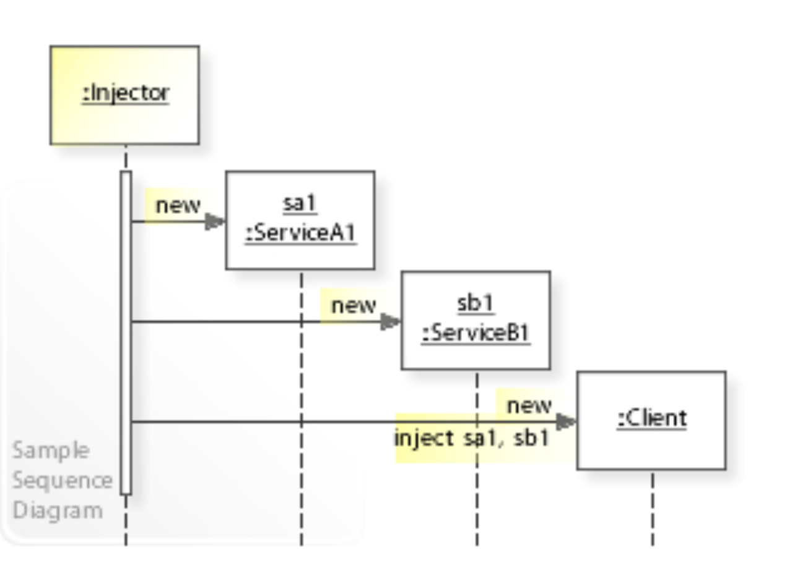

# 26.05.2020, Dienstag

### 9:00 Uhr - Start Week3 Day2

## Anwesenheit 


## Tagesablauf

- 9:00 Uhr: Wiederholung/Protokoll-Review
- 9:30 Uhr: Wiederholung Put- und Deletemapping in Postman
- 10:00 Uhr: Http Status codes
- 10:40 Uhr: Query Parameter am Beispiel der Search Methode
- 11:15 Uhr: Übung: Query Parameter
- 12:15 Uhr: Demo: Dependency Injection
- 12:45 Uhr: Übung: Dependency Injection Beispiel vom StudentService
- 13:00 Uhr: Mittagspause
- 14:00 Uhr: Fortführung Übung: Dependency Injection
- 15:20 Uhr: Kurze Einführung in Spring Annotations
- 16:00 Uhr: Demo: Covid Resttemplate
- 16:45 Uhr: Übung: Covid Resttemplate

## Ergänzung Postman
### Deletemapping
- Für eine Deletemapping im Postman muss ein Delete Endpunkt in der entsprechenden Methode des Controllers angelegt werden.

```
In public class StudentController:
    
    @Deleteemapoping("{id}")
    public Student removeStudent(@PathVariable String id) {
        
        Student studentToBeRemoved = getStudentById(Id);
        students.remove(studentToBeRemoved);
        return studentToBeRemoved;
    }

```
- Im Postman kann dann ein entsprechender Deleterequest über die Url gefeuert werden
    - Um in diesem Beispiel einen Studenten mit der ID "3" zu entfernen wäre die URL:
    ```
    localhost:8080/students/3
    ```
  
## HTTP Status Codes
- "Ein HTTP-Statuscode wird von einem Server auf jede HTTP-Anfrage als Antwort geliefert. Auf der anfragenden Seite steht dabei ein Client wie beispielsweise ein Webbrowser. Der Server teilt durch den HTTP-Statuscode dem Client mit, ob die Anfrage erfolgreich bearbeitet wurde. Im Fehlerfall gibt der Statuscode Auskunft darüber, wo (beispielsweise über eine Umleitung) oder wie (zum Beispiel mit Authentifizierung) er die gewünschten Informationen erhalten kann. Am bekanntesten sind dabei die Codes 404: „Nicht gefunden“, 403: „Fehlende Zugriffsberechtigung“ und 400: „Fehlerhafte Anfrage“.
   Die erste Ziffer eines Statuscodes stellt die Statusklasse dar."
   (Quelle: https://de.wikipedia.org/wiki/HTTP-Statuscode)
   
- Statusklassen im Überblick:
    - **1xx** – Informationen
    - **2xx** – Erfolgreiche Operation
    - **3xx** – Umleitung
    - **4xx** – Client-Fehler
    - **5xx** – Server-Fehler
    - **9xx** – Proprietäre Fehler
    
- Um einen Status code auszugeben wird zum Einen (ähnlich wie Optional in den Backend Exceptions) 'ResponseEntity' verwendet:

- Eine Weitere Möglichkeit ist die ResponseStatusException:

    - diese implizite Möglichkeit ist geschickter und ermöglicht es ohne großen Aufwand eine individuelle Exception message zu senden
    
## Query Parameter

### Definition
"Die Query-Komponente, häufig auch Query-String (englisch für Abfrage-Zeichenkette), ist Teil eines Uniform Resource Locators (URL) im World Wide Web und in RFC 3986 spezifiziert.[1] Die Query-Komponente enthält Daten, häufig in Form von benannten Parametern, die an einen Web-Server gesendet und vom nachgeschalteten Server-Teil einer Webanwendung ausgewertet werden können."
(Quelle: https://de.wikipedia.org/wiki/Query-String)

### Aufbau
- Ein Query-String wird mit einem Fragezeichen (?) eingeleitet
- Er besteht oft aus einem oder mehreren Parametern, häufig in Form von Schlüssel-Wert-Paaren, die oft mit einem Et-Zeichen (&) voneinander getrennt werden
- Parametername und -wert werden durch ein reserviertes Zeichen, meist ein Gleichheitszeichen (=), getrennt
- Mit Spring lassen sich durch die Annotation **@Requestparam** vor dem jeweiligen Parameter weitere Eigenschaften für die Query verändern bzw. initialisieren.

```
@GetMapping("search")
    public List<Student> getSearchForStudents(@RequestParam(name="q", required = false)String query, @RequestParam(required = false) Integer minAge){
        return service.findStudents(query,minAge);
    }
```
- Sucht man in diesem Beispiel nach einem query String "F" und einem minAge von 21, resultiert auf dem Localhost die URL:
```
localhost:8080/students/search?q=F&minAge=21
```

## Dependency Incection

### Definition
"Mit Dependency Injection ist es möglich – entsprechend dem Single-Responsibility-Prinzip – die Verantwortlichkeit für den Aufbau des Abhängigkeitsnetzes zwischen den Objekten eines Programmes aus den einzelnen Klassen in eine zentrale Komponente zu überführen.
 
 In einem herkömmlichen System objektorientierter Programmierung ist dagegen jedes Objekt selbst dafür zuständig, seine Abhängigkeiten, also benötigte Objekte und Ressourcen, zu verwalten. Dafür muss jedes Objekt einige Kenntnisse seiner Umgebung mitbringen, die es zur Erfüllung seiner eigentlichen Aufgabe normalerweise nicht benötigen würde.
 
 Dependency Injection überträgt die Verantwortung für das Erzeugen und die Verknüpfung von Objekten an eine eigenständige Komponente, wie beispielsweise ein extern konfigurierbares Framework. Dadurch wird der Code des Objektes unabhängiger von seiner Umgebung. Das kann Abhängigkeiten von konkreten Klassen beim Kompilieren vermeiden und erleichtert besonders die Erstellung von Unit-Tests."
(Quelle: https://de.wikipedia.org/wiki/Dependency_Injection)

### Aufbau mit Spring

1. Die 'sendende' Klasse wird zur sogennanten Service-Klasse und wird mit der Spring Annotation **@Service** gekennzeichnet

```
@Service
public class StudentService {

    private final List<Student> studentList = new ArrayList<Student>(List.of(
            new Student("Horst", 44, "Uni Bielefeld"),
            new Student("Wladi", 33, "Uni Paderborn"),
            new Student("Mike", 20, "FH Bielefeld"),
            new Student("Julia", 24, "FH Münster"),
            new Student("Heike", 37, "RWTH Aachen")
    ));

    public StudentService (){
    }
  }
```

2. In der 'empfangenden Klasse', in diesem Fall dem Controller, wird die Abhängigkeit von der Service Klasse 'injiziert' oder 'injected'
    - Die 'empfangende Klasse' ist somit der Service Klasse abhängig oder 'dependent'
    - Die 'injection' erfolgt durch finale Variablendeklaration und der Spring Annotation **@Autowired** über dem dazugehörigen Konstruktor

```
@RestController
@RequestMapping("students")
public class StudentController {

    private final StudentService service;

    @Autowired
    public StudentController(StudentService service) {
        
        this.service = service;
    }
   }
```
3. Spring selbst funktioniert dabei als 'injektor' beim Start der Applikation. 

(Quelle: https://upload.wikimedia.org/wikipedia/commons/1/10/W3sDesign_Dependency_Injection_Design_Pattern_UML.jpg)


 > Vorteile von Services:  
  >- Kapselung für Business Logik
  >- Unabhängig von Rest Endpunkt
  >- Logik separat testbar                            
  >- Wiederverwendbar


## Annotations
- Es ist möglich Annotations selbst zu schreiben
- Für uns ist das Lesen der Annotations wichtiger
- Klassen können auf Annotationen “gescannt” werden
- Logik kann hinzugefügt werden
- Spring nutzt Annotationen um Logik zu erweitern
- 'Target' der Annotation gibt an für welchen Elementtyp die Annonations zulässig ist
    - > Beispiel @Getmapping ist durch Target({ElementType.METHOD}) nur für Methoden zulässig

## Covid Rest Template

### Erklärung

Bislang haben wir apis nur aus dem Terminal oder aus dem Postman heraus angesprochen. 
Das Rest Template ist dazu da um eine api aus dem Backend heraus anzusprechen.

### Aufbau

1. Erstellen einer Data Klasse, welche die gewünschten Daten aus dem api Request hält.
    - Die Klasse erhält die Annotation @Data
    - Wenn die api Uppercase Properties zurückgibt, führt das häufig zu Problemen -> @JsonProperty hilft die Property Bezeichnungen zu korrigieren
```
@Data
@NoArgsConstructor
@AllArgsConstructor
public class CovidApiCountryStats {


        @JsonProperty("Active")
        private int active;

        @JsonProperty("Date")
        private String date;

}

```

2. Erstellen einer api Klasse, welche das template hält.
    - Die Klasse erhält die Annotation @Service
    - Die ankommenden Json's werden in Arrays gehalten 

```
@Service
public class Covid19Api {

    public int numberOfActiveInfections(){
        RestTemplate restTemplate = new RestTemplate();
        String url = "https://api.covid19api.com/total/country/germany?from=2020-05-24T00:00:00Z&to=2020-05-25T00:00:00Z";

        ResponseEntity<CovidApiCountryStats[]> responseEntity = restTemplate.getForEntity(url, CovidApiCountryStats[].class);

        CovidApiCountryStats[] covidData = responseEntity.getBody();


        if(covidData.length > 0){
            return covidData[0].getActive();
        }
        throw new IllegalStateException("No data from covid api");
    }

}
```

#### Resources

- https://github.com/fabianschmauder/student-db-web
- https://documenter.getpostman.com/view/10808728/SzS8rjbc?version=latest#4bad095c-e106-4eb1-9498-ec5954d2165d
- https://de.wikipedia.org/wiki/Query-String
- https://de.wikipedia.org/wiki/Dependency_Injection
