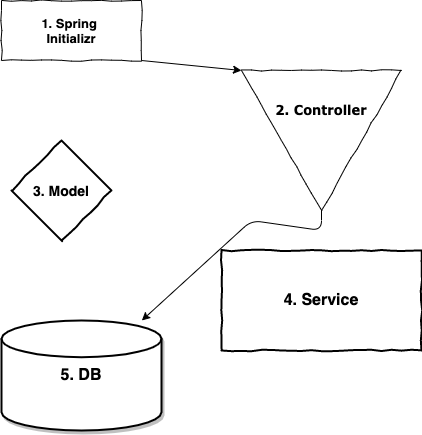
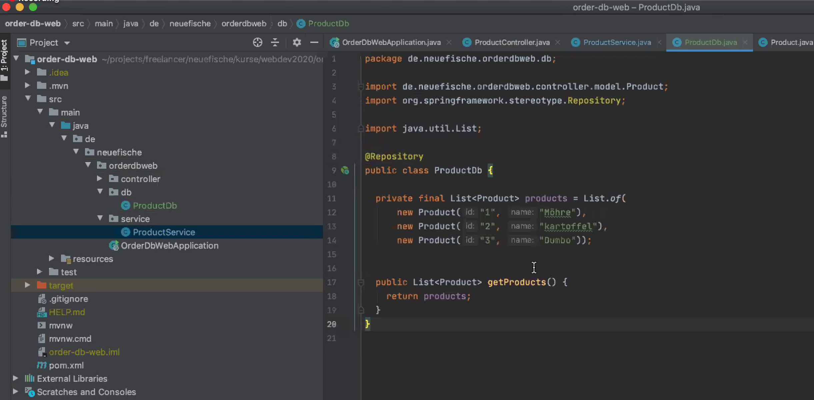

# 27.05.2020, Mittwoch

### 9:00 Uhr - Start Week3 Day3

## Anwesenheit 


## Tagesablauf

- 9:00 Uhr: Protokoll-Review
- 9:30 Uhr: Aufgabenstellung Product-Order 
- 10:00 Uhr: Gruppenphase: Aufgabe Product-Order-DB Web
- 12:00 Uhr: Besprechung
- 12:30 Uhr: Gruppenphase
- 13:00 Uhr: Mittagspause
- 15:00 Uhr: Demonstration/ Lösungsweg Fabian
- 16:00 Uhr: Gruppenphase: Erweiterung Product-Order-DB Web


#### Übersicht


#### Struktur der Aufgabe

[(Week3 Folie 8)
Link zur Aufgabenstruktur](https://docs.google.com/presentation/d/1IzGaANkhJ8vYpugFEV_L6OSgimWEKr8ytojxdQpMKW0/edit#slide=id.g806f0be299_0_893)
___


### Lösung Fabian (Start Controller)

| Start bei Controller              | vs.| Start bei DB                          |
|:--------------------------------- | ---|:------------------------------------- |
|- eher Realität, da Struktur       |    | - geht bei uns, da Struktur vorgegeben|
|       nicht bekannt               |    |                                       |
|- nur Methoden, die wir benötigen  |    | - Code muss nicht verschoben werden   |                               
|- nur an einer Stelle Änderungen   |    |                                       |
|- Controller wird nach außen gegebn|    |                                       |
|-Fehler werden schneller gefunden  |    |                                       |

#### Ablauf 
 


#### 1. Spring Initializr

Beginn mit Spring Initializr

#### 2. Controller (hier: ProductController)

###### Vorher:

```@Restcontroler
@RequestMapping("products)
public class ProductController {

@GetMapping
public List<Product> getProduct(){
    return List.of(new Product("1","Möhre"),
           new Product("2","kartoffel")
    }
}
```

###### Nachher:

```@RestController
   @RequestMapping("products")
   public class ProductController {
   
     private final ProductService productService;
   
     @Autowired
     public ProductController(ProductService productService) {
       this.productService = productService;
     }
   
     @GetMapping
     public List<Product> getProducts(){
       return this.productService.getProducts();
     }
   
   }
```

#### 4. Service (hier: ProductService)

###### Vorher:

```
@Service
public class ProductService{
    
    public List<Product> getProduct(){
        return List.of(new Product("1","Möhre"),
          new Product("2","kartoffel")
    }
}
```

###### Nachher:

```
@Service
public class ProductService {

  private final ProductDb productDb;

  @Autowired
  public ProductService(ProductDb productDb) {
    this.productDb = productDb;
  }

  public List<Product> getProducts() {
    return productDb.getProducts();
  }
}
```

#### 5. DB (hier: ProductDB)





#### 3. Model (hier: Product)


```
@Data
@AllArgsConstructor
@NoArgsConstructor
public class Product {
    private String id;
    private String name;
}
```

---

#### Ausblick

- Tests mit Spring
- Anbindung Datenbank
- Anbindung Frontend


#### Resources

- [GitHub Repo Fabian Link](https://github.com/fabianschmauder/order-db-web)
- [Spring Tutorial Link](https://www.youtube.com/watch?v=vtPkZShrvXQ)
