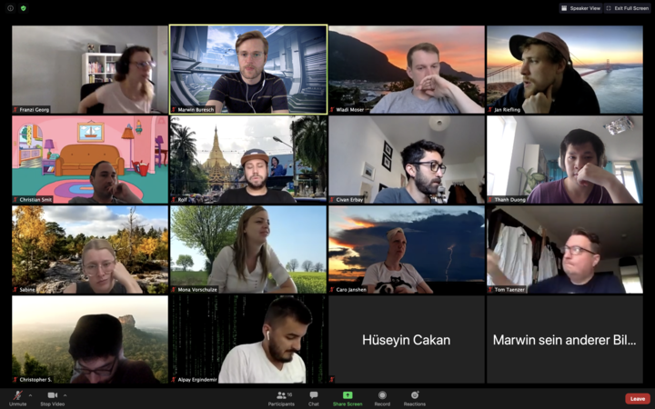
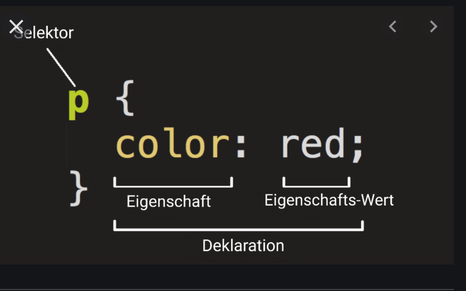
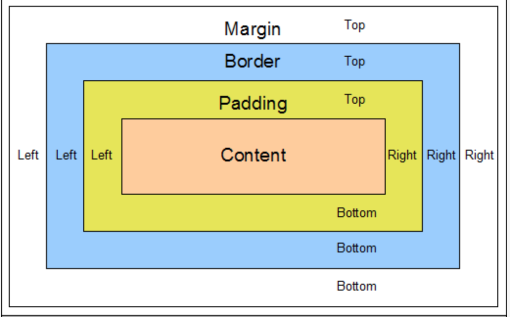

# 02.06.2020, Dienstag

## Anwesenheit

## Tagesablauf

## Inhalte

### ToDo App Freitagsaufgabe
- siehe Zoom record

### Erwartungen für Woche 4 Frontend
- Everything in english
- HTML / CSS
- Framework
- Bootstrap	

### HTML
- Hypertext Markup Language
	- website structure
	- not a programmin language
	- opening tag > content > closing tag
		
- Tools
	- Browser (Chrome)
		- developer Tools `(cmd + option + i)`
			- select element `(cmd + shift + c)`
		- check if browser can use code http://caniuse.com > which browser versions support the code
	- Editor
		- IntelliJ
		- CodePen.io
	- Terminal
	- Git
	- git online service (GitHub, GitLab, Bitbucket)
	- anything that enhances developer experience
	- Framework	
		- Bootstrap
		
- Elements	
	- HEAD
		- title
		- meta
			- charset 
			    - UTF-8
		- link to css and JS files	
	- viewport (everything within the browser window exclusive taskbar and such)
		- vw viewport width
		- vh viewport height
	- BODY
		- contains the website content		
	- elements are building blocks
    - block > takes full horizontal space
    - inline > takes up as much horizontal space as needed
    - void (have attributes but no content)
    - attributes
        - give additional information to an element
    - cascaded structure
	
- Structure
	- opening tag > attribute > attribute value > conetent > closing tag
	- `<div` `class` `="classname">` `<p>Css is awesome</p>` `</div>`
		
- Semantics
	- sectioning see next codeblock

### CSS
- defines a website look
- frameworks
	- Bootstrap 4
	- Tailwindcss
	- Material-UI
	
- basics
	- cascading style sheets
		- location
		- inheritance
		- specificity
	- declarative language / no programming language
	- ruleset
	
- inserting styles
	- `<head>...<link ref=”stylesheet” href=”path/to/styles.css”>...</head>`
	- browser can cache the css files
	- style tag
		- allows css within an html files
		- not often used
			- if css file is huge and some css needs to be loaded before
	- inline styles
		- styles directly inside html tags 
		- `<a style=”color: springgreen”>Home</a>`
		- overrides css file stylings	
	- Anatomy
		
		- css ruleset
			```
			h1 {
				color: #000;
			}	
	- Text styles	
		- `font-family`
			- Google fonts import in head https://fonts.google.com/
		- `font-size`
		- `font-weight`
		- `font-style`
		- `text-decoration`
		- `line-height`
		- `letter-spacing`
	
	- Box Model
	
		- margin > space to the next element (outside of the element)
			- `margin-top`
			- `margin-bottom`
			- `margin-left`
			- `margin-right`
			
		- border > border around the box (margin is outside of the border)
			- `border-radius`
			- `border-style`
				- `dashed`
				- `dotted`

		- padding > space between border and content
			- `padding-top`
			- `padding-bottom`
			- `padding-left`
			- `padding-right`
			
		- box-sizing
			- `border-box`
			- `content-box`
			
	- Display property	
		- `display:block`
			- 100% width
		- `display:inline`
			- flows with text
			- width as needed
		- `display:inline`
			- no vertical padding and margin
		- `display:inline-block`

### exercises

#### add mdn to chrome
- ... > Settings > search engines > manage search engines > add new search engine > https://developer.mozialla.ord/en-Us/search?q=%s

#### find HTML elements that are interesting
- details
- map
	- area
- datalist 
- mark
- template
- base
- picture
- noscript
- span
- style
- cite
- canvas
- noscript	

#### create layout (without css)


- use http://codepen.io or some other editor to create the shown layout
		
    ```
    <!DOCTYPE html>
    <html lang="en">
        <head>
            <meta charset="UTF-8">
            <meta name="viewport" content="width=device-width, initial-scale=1.0">
            <meta http-equiv="X-UA-Compatible" content="ie=edge">
            <title>Marwin's Blog yeah</title>
        </head>
        <body>
            <header>
                
                <h1>Marwin sein Blog 9000</h1>
            </header>
            <main>
                <article>
                    <header>
                         <h2>Blog entry #1</h2>
                         <h3>what a subtitle</h3>
                    </header>
                    <section>
                        <p>Lorem ipsum dolor sit amet, consectetur adipisicing elit. ipsam praesentium aliquam maxime suscipit possimus?</p>
                        <button>more...</button>
                    </section>
                    
                </article>
            </main>
            <aside>Sidebar</aside>
            <footer>
                <span>©</span> I made this in 2020
            </footer>
        </body>
    </html>	
		
#### Use CSS Flukeout
- https://flukeout.github.io/

#### try to copy the above image (now with css but without display:flex)
