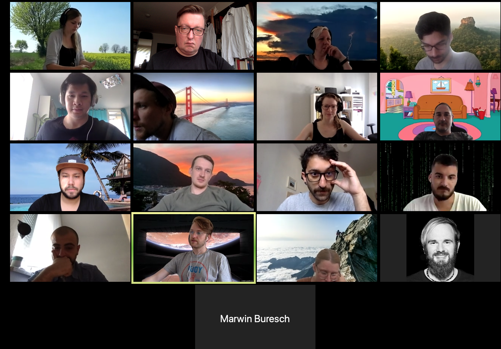
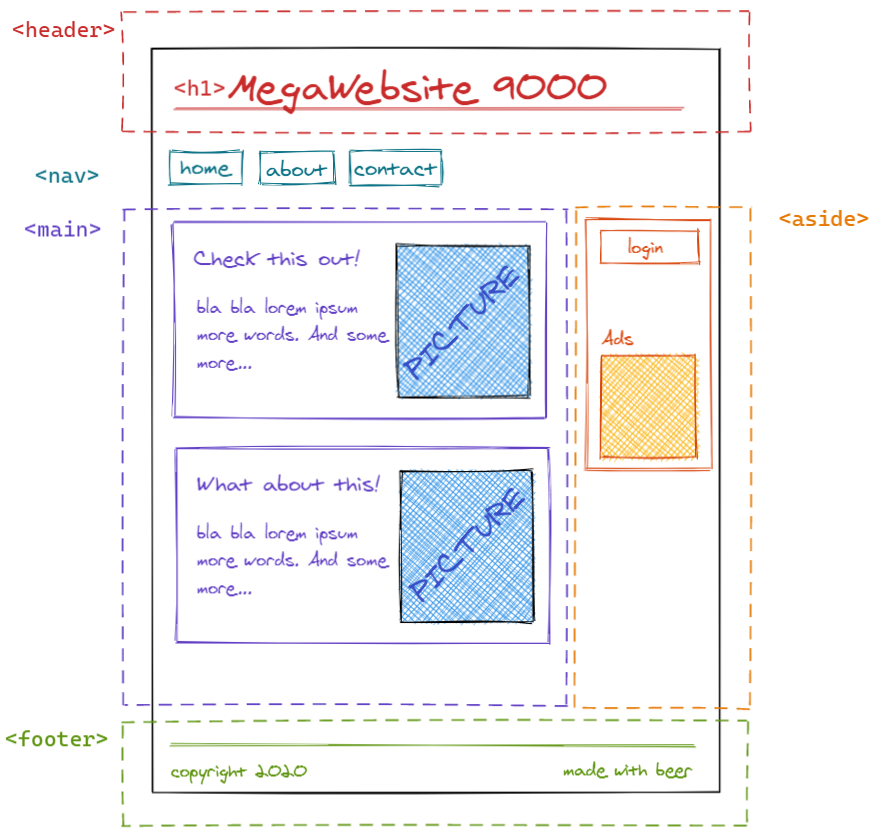
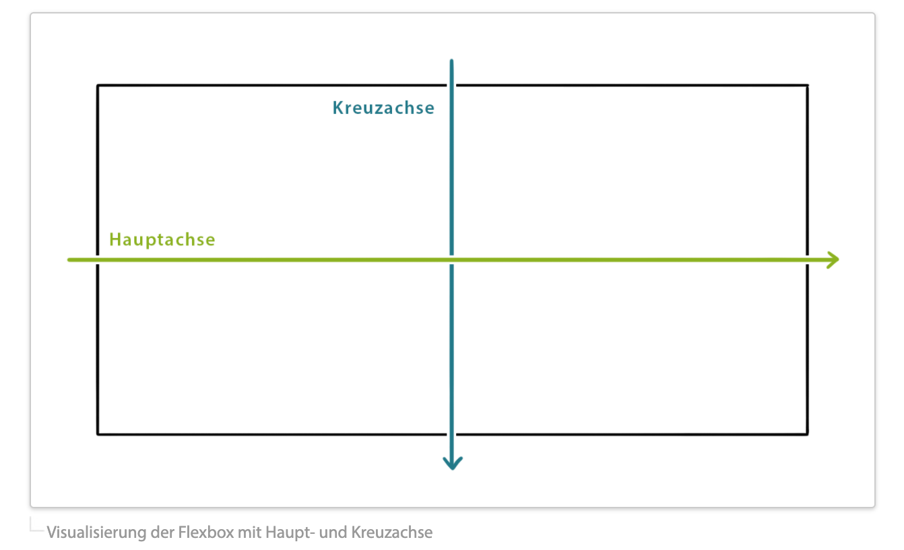
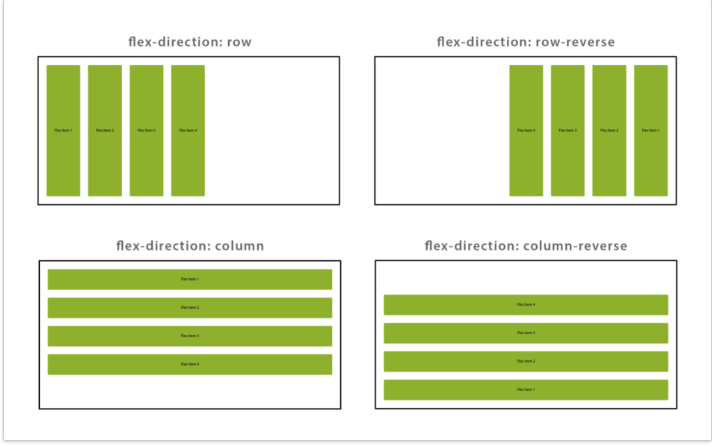
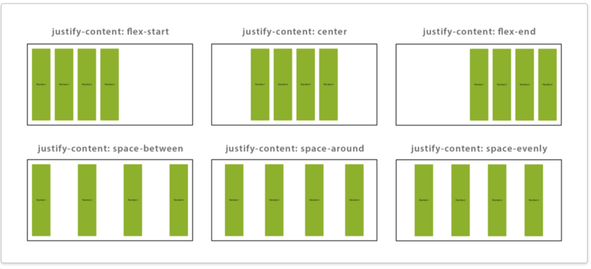
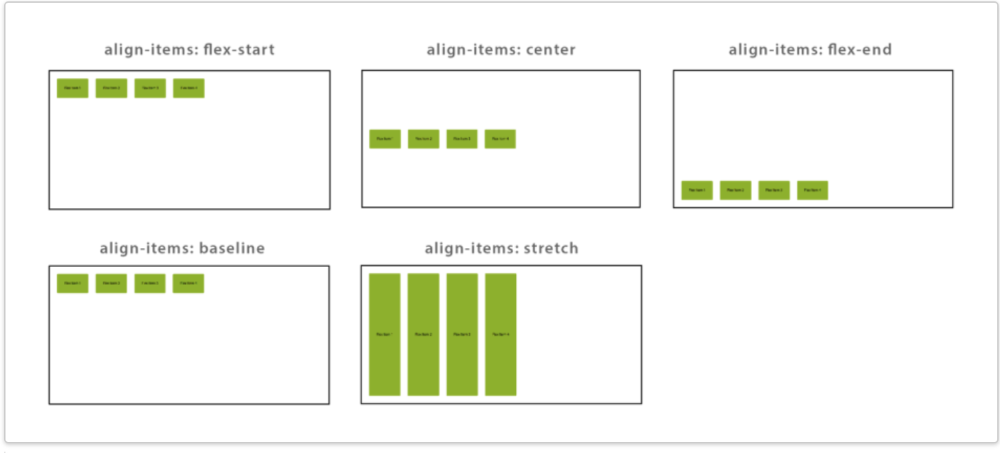
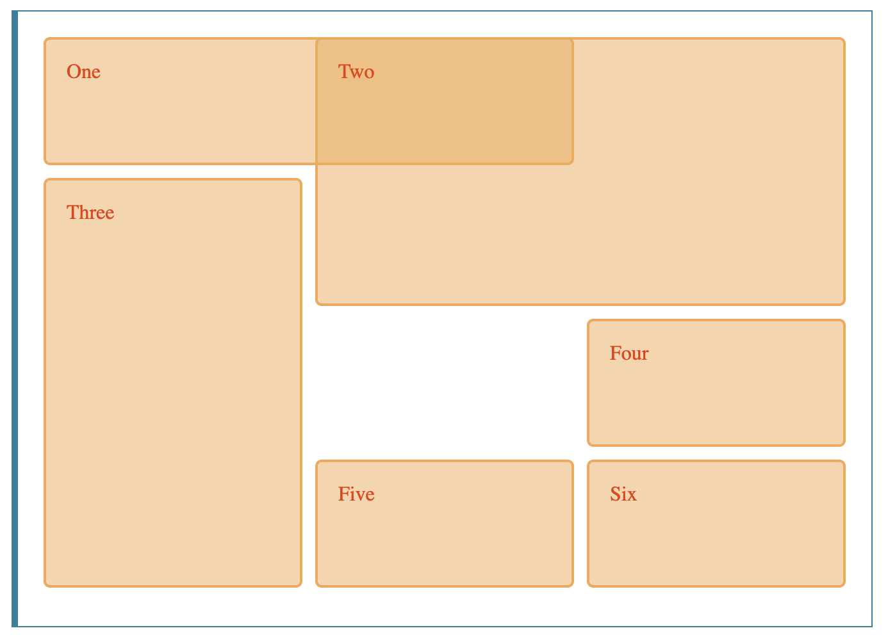

# 03.06.2020, Mittwoch

### 9:00 Uhr - Start Week4 Day2

## Anwesenheit

 

## Tagesablauf
- 09:00  **1. Protokoll** 
- 09:40  **2. Aufbau einer Website**
- 10:00  **3. Setup Codeeditor Intellij**
- 10:05  **4. Normalize CSS** 
- 10:37  **5. CSS-Flexbox** 
- 11:33  **6. Übung zu Flexbox / Tag-List**
- 13:00  **Pause** 
- 14:00  **7. Besprechung Übung zu Flexbox**
- 14.45  **8. CSS default-values**
- 15:00  **9. Flexbox basis**
- 15.12  **10. Einführung Grid**
- 15.37  **11. Gridgarden**
- 16:20  **12. Praxisübung Grid**


## Aufbau einer Website - HTML Grundstruktur

- Eine Website unterteilt sich grob in folgende Elemente:
    - html
    - head
    - body
    - navbar
    - main
    - sidebar
    - footer
    
    
  


## CSS-Flexbox
 - Ein Konzept, um Elemente dynamisch auszurichten
 - Eltern-Elemente vererben nur an ihre Kind-Elemente
 - Die Kind-Elemente werden an der jeweils im Eltern-Element angesprochene Achse ausgerichtet
 

Resource: https://blog.kulturbanause.de/2013/07/einfuhrung-in-das-flexbox-modell-von-css/

# Deklarationen
    .flex-container {
        display: flex;
        }
Deklaration des Eltern-Elementes als Flexbox.

 - ``justify-content`` - Ansteuerung der Items auf der Hauptachse
 - ``align-items`` - bewegt die Items auf der Kreuzachse
 - ```flex-direction``` - Hauptachse wird gedreht
 - ``flex-direction`` kann folgende Werte annehmen:
    -   ``row``  (von links nach rechts)
    - ``column`` (von oben nach unten)
    - ``row-reverse`` (von rechts nach links)
    - ``column-reverse`` (von unten nach oben)
 

Resource: https://blog.kulturbanause.de/2013/07/einfuhrung-in-das-flexbox-modell-von-css/

# justify-content

- Im flexcontainer werden die Items auf der Hauptachse wiefolgt bewegt:
    
        justify-content: flex-start 
        justify-content: center
        justify-content: flex-end
        justify-content: space-between
        justify-content: space-around
        justify-content: space-evenly 
       


# align-items
        align-items: flex-start 
        align-items: center
        align-items: flex-end
        align-items: baseline
        align-items: stretch



# Weitere Eigenschaften

-  `flex grow`: Werte über 0 bedeuten, dass die jeweiligen Items größer werden dürfen als festgelegt
-  `flex shrink`: Werte über 0 legen fest, dass die jeweiligen Items kleiner werden dürfen als festgelegt
- ``flex-basis``: Items richten sich anhand der hier gegebenen Werte in ihrer Größe aus
        
- weitere nützliche Deklarationen und wie sie eigesetzt werden können unter:
 https://developer.mozilla.org/de/docs/Web/CSS/CSS_Flexible_Box_Layout/Grundlegende_Konzepte_der_Flexbox


## Grid
   - Weiteres Element um Inhalte auszurichten bzw. anzuordnen.
   - Funktionen orientieren sich an einem vorher festgelegten Raster innerhalb des Eltern-Elementes
   - Eltern-Elemente vererben / kontrollieren direkt (an) ihre Kind-Elemente
   
# Beispiel

        <div class="wrapper">
          <div class="one">One</div>
          <div class="two">Two</div>
          <div class="three">Three</div>
          <div class="four">Four</div>
          <div class="five">Five</div>
          <div class="six">Six</div>
        </div>
   
   
   CSS:
    
        .wrapper {
          display: grid;
          grid-template-columns: repeat(3, 1fr);
          grid-gap: 10px;
          grid-auto-rows: minmax(100px, auto);
        }
        .one {
          grid-column: 1 / 3;
          grid-row: 1;
        }
        .two { 
          grid-column: 2 / 4;
          grid-row: 1 / 3;
        }
        .three {
          grid-column: 1;
          grid-row: 2 / 5;
        }
        .four {
          grid-column: 3;
          grid-row: 3;
        }
        .five {
          grid-column: 2;
          grid-row: 4;
        }
        .six {
          grid-column: 3;
          grid-row: 4;
        }



Resource: https://developer.mozilla.org/de/docs/Web/CSS/CSS_Grid_Layout


## Resources
- https://www.w3schools.com/cssref/css_default_values.asp
- https://github.com/h5bp/html5-boilerplate
- https://docs.emmet.io/cheat-sheet/
- https://developer.mozilla.org/en-US/docs/Learn/CSS/Building_blocks/Values_and_units
- https://demos.scotch.io/visual-guide-to-css3-flexbox-flexbox-playground/demos/
- https://css-tricks.com/snippets/css/complete-guide-grid/
- https://cssgridgarden.com/
