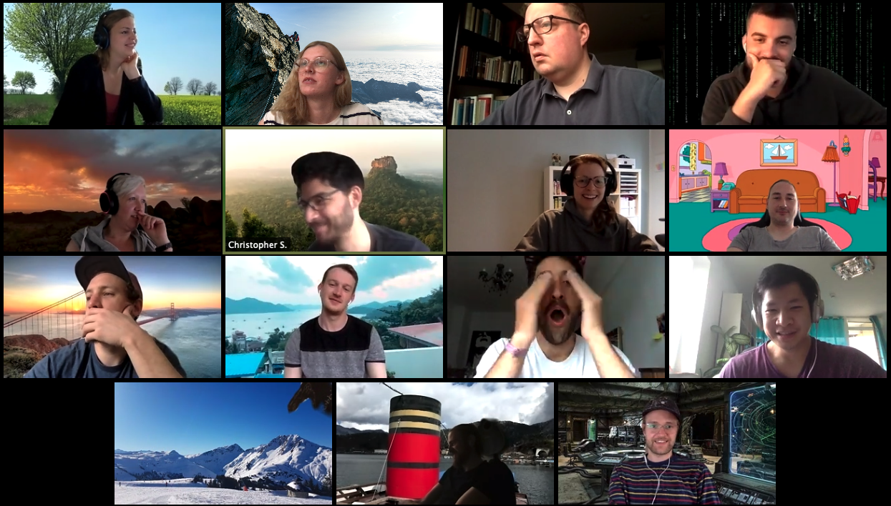
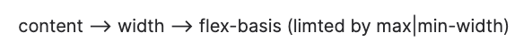
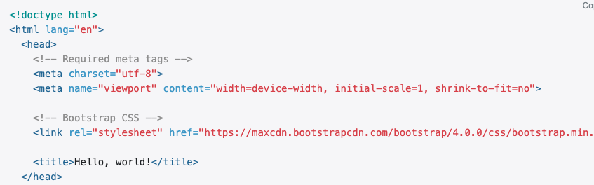
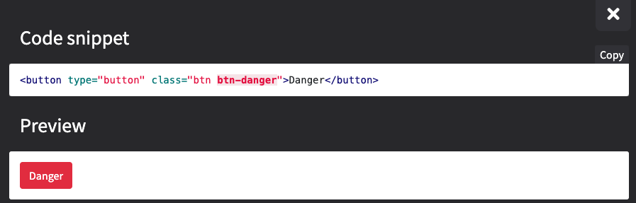
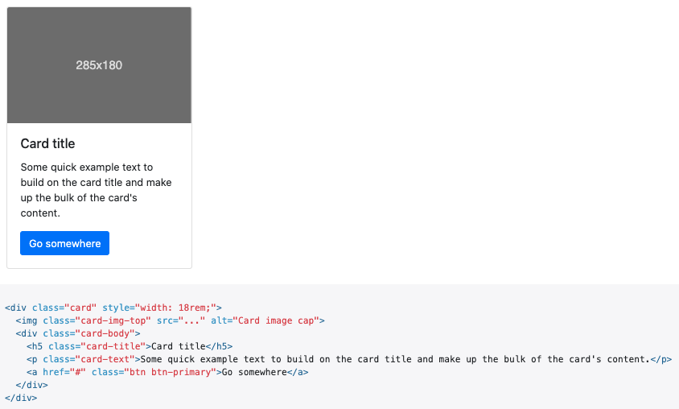

# Donnerstag, 06.06.2020

### 9:00 Uhr - Start Week 4, Day 3

## Anwesendheit 

## Tagesablauf

- 09:00 Uhr: Protokoll-Review
- 09:30 Uhr: "Wie gehts euch” - Runde mit Anne
- 10:00 Uhr: Wiederholung Flexbox - Beispiel Dinocard 
- 11:45 Uhr: Einleitung Frameworks
- 13:00 Uhr: Mittagspause
- 14:00 Uhr: Praxisübungen mit Bootstrap
- 16:00 Uhr: Bis zum Feierabend mit Komponenten und Co spielen

---
#### Beispiel Flexbox - Dinocard

- Entwurf erstellen (z.B. mit https://excalidraw.com , https://figma.com oder https://xd.adobe.com)
- Anpassung der Dino Datei von Grid auf Flex: 
  - Image benötigt kein width mehr, da es über flex geregelt wird (s.Link)
  - [All about the difference between width and flex basis ](https://mastery.games/post/the-difference-between-width-and-flex-basis/)
  
  - Grid aus Klassen entfernen und durch flex-basis, flex-grow und flex-flow ersetzen

---
#### Einleitung Framework Bootstrap

- Bootstrap wurde 2010 von Twitter unter dem Namen „Twitter Bootstrap“ entwickelt, mit dem Ziel, eine einheitliche Bibliothek für die Gestaltung von Weboberflächen zu schaffen. Es beinhaltet z.B. Gestaltvorlagen für Farben, Typografie, Formulare, Buttons, Grid-Systeme, Tabellen u.v.m. 
Nach einigen Monaten der Entwicklung veranstaltete Twitter die erste Hack Week und das Projekt explodierte förmlich, als Entwickler mit den unterschiedlichsten Fähigkeiten anfingen, es zu verwenden, ganz ohne Unterstützung von außen. Später wurde es zu einem Open-Source-Framework und wird seitdem vom Gründerteam gepflegt.
    - [Einleitung Bootstrap / Wie starte ich?!](https://getbootstrap.com/docs/4.0/getting-started/introduction/) 

    - Weitere Frameworks sind Tailwind, Material oder Materialize (Links in Resources)

- Um Bootstrap nutzen zu können, Stylesheet in den Head einfügen.

- Ein eigenes CSS Dokument ist somit nicht mehr nötig. Falls es gewünscht ist, für individuelle Layoutänderungen, dann CSS-Dokument unter Bootstrap verlinken!
- Elemente können nur durch Inline-code angepasst werden.
#### Einfache Beispiele für Framework Komponenten:
- Buttons in HTML einfügen.

- Cards in HTML einfügen

    - Weitere Hilfe für Bootstrapklassen: https://hackerthemes.com/bootstrap-cheatsheet/ 
---
     CSS is all about experience – read a lot and practice a lot!!

#### Resources

- cmd + control + tab --> Emojilist in IntelliJ
- Blindtext generieren: lorem30 + tab = ergibt 30 Worte
- [Free Pictures](https://pixabay.com/)
- [Framework Tailwind](https://tailwindcss.com)
- [Framework Material](https://material.ir)
- [Framework Materialize](https://materialize.com)
