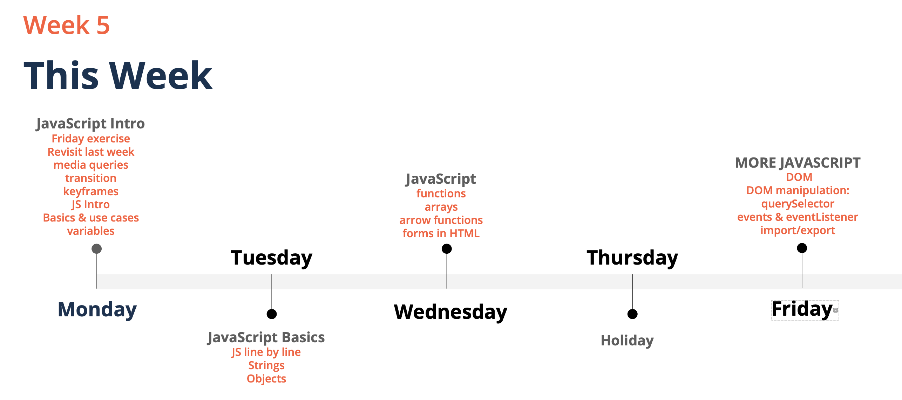

# 09.06.2020, Dienstag

### 9:00 Uhr - Start Week5 Day2

## Anwesenheit

## Tagesablauf

- 09:00 Uhr: Protokoll
- 09:30 Uhr: Module (Import und Export von Funktionen)
- 13:00 Uhr: Lunch
- 14:00 Uhr: Events & Event Handler
- 15:45 Uhr: Arrow function
- 16:30 Uhr: Array
- 17:50 Uhr: Ende

## Week Preview

## Module

#### Was ist ein Modul?
Modulsysteme sind nützlich. Sie bieten einen Weg, Code über verschiedene Anwendungen und Plattformen hinweg wiederzuverwenden. Über Im- und Exporte können sie beliebig in anderen Modulen verwendet werden. Sie sind modular und lassen sich unabhängig voneinander editieren und löschen

„export“ Das export-Statement wird verwendet, um Funktionen und Objekte aus einer gegebenen Datei (oder Modul) zu exportieren.

„import“ ermöglicht den Import von Funktionen aus anderen Modulen.

Aufgabe:
- Funktionen auslagern in eine andere Datei
- Funktionen aus anderen Dateien exportieren und in andere Dateien importieren

Beispiel Calculator von Montag: (JavaScript)  

    const firstNumber = Number(prompt("Enter 1st number, plz:"));
    const operator = prompt("enter an operator, plz: +, -, * or / ");
    const secondNumber = Number(prompt("Enter 2nd number, plz:"));
    alert(`The result is: ${calculate(firstNumber,secondNumber,operator)}`);
    
    function calculate(firstNumber, secondNumber, operator){
        switch (operator) {
            case "+": return firstNumber + secondNumber;
            case "-": return firstNumber - secondNumber;
            case "*": return firstNumber * secondNumber;
            case "/": return firstNumber / secondNumber;
            default: throw new Error("something went wrong");
        }
    }

Schritte:
1. Snippet „secondNumber“ auslagern
2. Neuer Ordner utils erstellen
3. Unter Utils wird eine JS „Calculation“ erstellt
4. Die FunKtion wird in „Calculation“ ausgelagert

#### Das Warum : 
1. So lassen sich Funktionen modular von einander editieren und löschen
2. Unser Code wird übersichtlicher 

## Events & Event Handler
#### Was sind Events (Ereignisse) und Event-Handler? 
Events (Ereignisse) und Event-Handler (Ereignisbehandler) sind ein wichtiges Bindeglied zwischen HTML und JavaScript. Event-Handler werden entweder in Form von Attributen in HTML-Tags notiert (siehe auch HTML/Eventhandler), besser aber mittels der Methode addEventListener hinzugefügt.

- Immer wenn wir z.B. einen Button drücken wird ein „Event“ gefeuert
- Wir möchten einen Event-Handler schreiben
- Zunächst müssen wir es schaffen, dass Event abzufangen, damit wir es in Java Script behandeln können
- um das Event abzugreifen, müssen wir uns das Element mit query.selectoren 
   --> "get Element bei ID" holen
- Dieses Element erwartet jetzt einen String
- Wir bauen ein Click-Event
- Click-Events können immer abgefragt werden 

Lösung:

#### Das Warum : 
1. Ein Event-Hanlder zeigt HTML an, dass eine Action ausgeführt werden soll. 

## Arrow function

Resource  
Marwin: https://javascript.info/arrow-functions-basics  
Civan: https://www.freecodecamp.org/learn/javascript-algorithms-and-data-structures/es6/use-arrow-functions-to-write-concise-anonymous-functions 

#### Was ist eine Arrow function? 

- Verkürzte Schreibweise einer Funktion
- die Funktion ist anonym - und kann nicht von außen aufgerufen werden
- Man benutzt sie hauptsächlich, dort wo call backs erwartet werden
- Add Event Listener benötigt eine Funktion. Aus diesem Grund geben wir die Arrow function an, um keine weitere function separat definieren zu müssen

Vorher 

Nachher 

Variante multi-line 

#### Das Warum : 
1. Durch die Arrow function haben wir die Möglichkeit Call Backs direkt als function 
zu definieren  und müssen die funktion nicht separat noch einmal schreiben.
2. Wir verkürzen die Schreibweise des Codes 

## Array
#### Was ist ein Array? 

JavaScript-Arrays werden verwendet, um mehrere Werte in einer einzigen Variablen zu speichern.  
syntax:  var array_name = [item1, item2, ...];  

Aufgabe: Einen User hinzufügen 
Lösung: 

Aufgabe: Einen User löschen 
Lösung: 

Aufgabe: Usernamen finden 
Ressoucre: 
https://developer.mozilla.org/en-US/docs/Web/JavaScript/Reference/Global_Objects/Array  
Lösung: 

### Marwins Zeichnung :)

#### Finales Ergebnis Array-Aufgabe 
 ##### JS-Code

    const addUserButton = document.getElementById("addUser")
    addUserButton.addEventListener("click",()=>addUser());
    
    const undoUserButton = document.getElementById("undoUser")
    undoUserButton.addEventListener("click",()=>undoLastAddUser());
    
    const findUsernameButton = document.getElementById("findUsername")
    findUsernameButton.addEventListener("click",()=>findUserByName(getSearchValue()));
    
    const userDb = [
        {
            id: 87694,
            name: "Marwin"
    },
        {
            id: 98373,
            name: "Fabian"
        }
    ];
    
    function addUser(){
        let newUser = {};
        newUser.id = Number(prompt("Please enter a user ID (num):"));
        newUser.name = prompt("Please choose a username:");
        userDb.push(newUser);
        console.log(userDb);
    
    }
    
    function undoLastAddUser(){
        const deleteUser = userDb.pop();
        console.log('User has been deleted')
        console.log(deleteUser);
        console.log(userDb);
    }
    
    function getSearchValue(){
        return prompt("Enter a search parameter")
    }
    
    function findUserByName(userName) {
        console.log(userDb.find(userDbEntry=> userDbEntry.name.toLowerCase() === userName));
    }
    }
##### HTML-Code

    <!DOCTYPE html>
    <html lang="en">
    <head>
        <meta charset="UTF-8">
        <title>Array</title>
    </head>
    <body>
        <button id="addUser">user</button>
        <button id="undoUser">undo last add-user</button>
        <button id="findUsername">find username</button>
        
    </body>
    
    </html>
    
    
## Resources
- Slides Week5: https://docs.google.com/presentation/d/1sGI_AE5HBhx8T1q42Z2MO9iGzcwtjvdA-USMwHl7upA/edit#slide=id.p5
 - Civan: https://stackoverflow.com/questions/38051376/onclick-function-is-not-defined
 https://www.freecodecamp.org/learn/javascript-algorithms-and-data-structures/es6/use-arrow-functions-to-write-concise-anonymous-functions
- Marwin: https://javascript.info/modules-intro
 https://javascript.info/introduction-browser-events
 https://javascript.info/arrow-functions-basics
 https://javascript.info/ifelse#conditional-operator
 https://developer.mozilla.org/en-US/docs/Web/Guide/HTML/Content_categories
 https://developer.mozilla.org/en-US/docs/Web/HTML/Element/script
 https://javascript.info/array-methods