# 10.06.2020, Mittwoch

### 9:00 Uhr - Start Week5 Day3

## Anwesenheit

## Tagesablauf

- 9:00 Uhr: Protokoll vom Dienstag
- 9:30 Uhr: Wiederholung Array / Aufgabe UserDb
- 9:45 Uhr: Array Filter-method
- 10:30 Uhr: Object.values
- 12:45 Uhr: Object references
- 13:00 Uhr: Lunch
- 14:00 Uhr: map-method
- 14:30 Uhr: Formulare - input Element
- 16:00 Uhr: Formulare - checkbox Element
- 16:40 Uhr: fetch
- 18:00 Uhr: Ende

## Array Filter-method

The find() method looks for a single (first) element that makes the function return true.
If there may be many, we can use filter().

The filter() method creates a new array with all elements that pass the test implemented by the provided function.

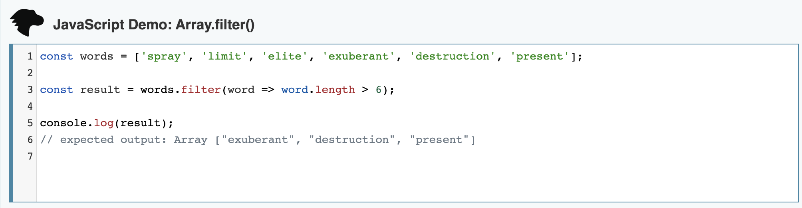
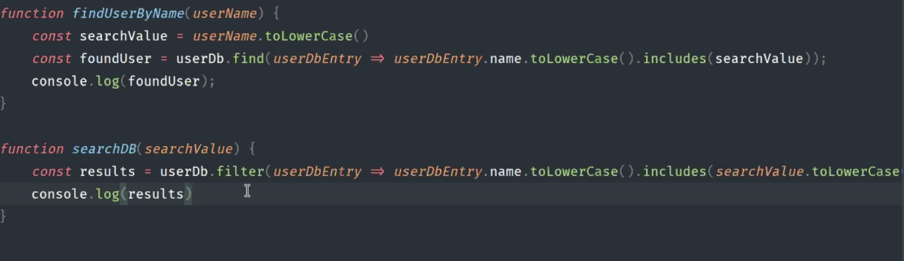

## Object methods

- Object.values() --> gibt alle values (rechte Seite) im Objekt als Array zurück
- Object.keys() --> gibt alle keys (linke Seite) im Objekt als Array zurück
- Object.entries() --> gibt alle entries (beide Seiten) im Objekt als Array zurück

### warum machen wir das?

- mit Objekten kann man schlecht arbeiten
- durch die Umwandlung zum Array hat man wieder Zugriff auf sämtliche Array-functions wie find, filter, map usw.

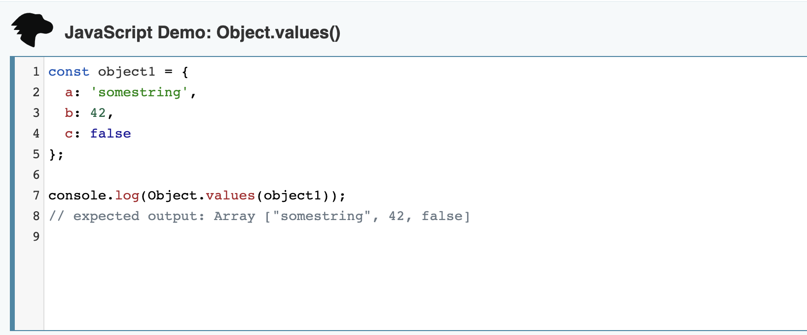
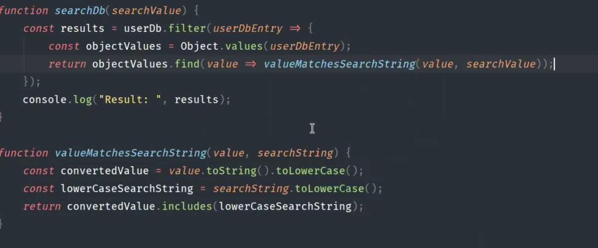

## Object copying, references

Primitive Datentypen wie strings, numbers, booleans –-> beim Kopieren wird der Wert komplett kopiert --> copied "by value"

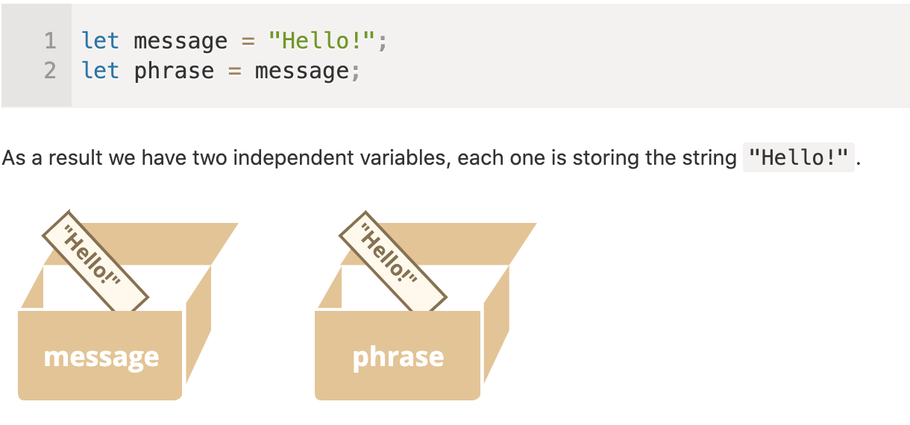

Objects und Arrays --> beim Kopieren wird nur nicht das Objekt/Array kopiert, sondern nur eine Referenz im Speicher wird erzeugt --> copied "by reference" 

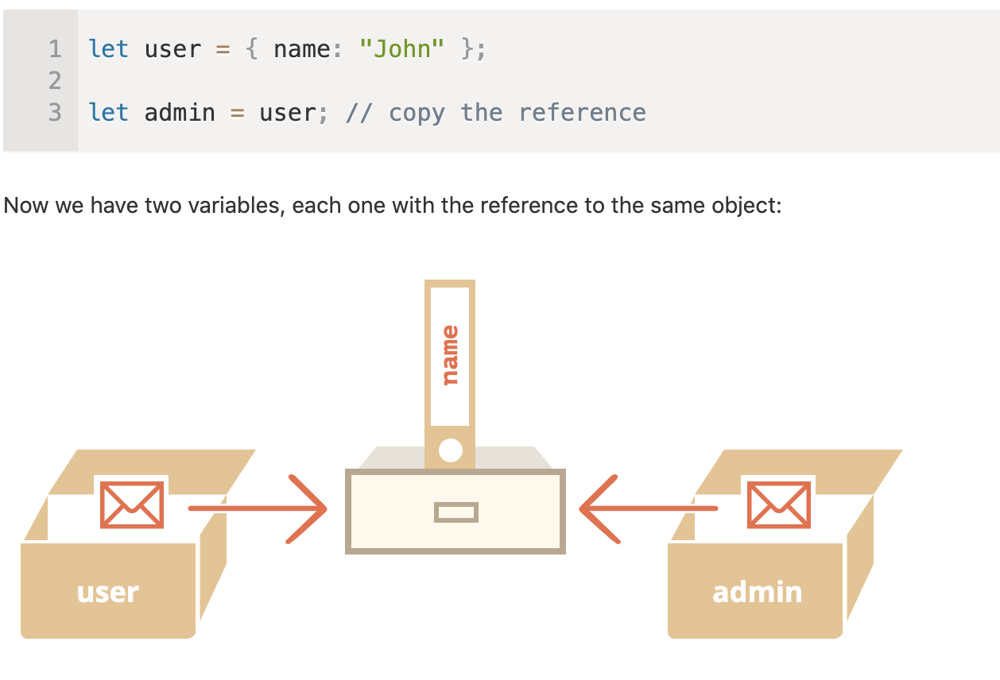

Here, the object is stored somewhere in memory. And the variable user has a “reference” to it.

When an object variable is copied – the reference is copied, the object is not duplicated.
Now we have two variables, each one with the reference to the same object.

## map-method

- nimmt ein Array und erzeugt daraus ein neues Array mit anderen Eigenschaften (basierend auf das "Ausgangsarray")

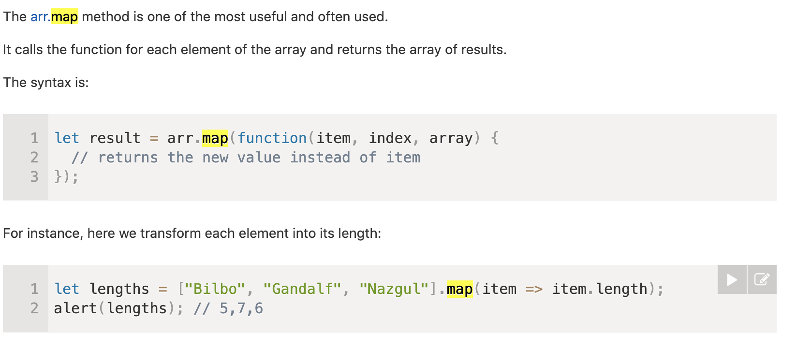

## Formulare - input Element

The HTML input element is used to create interactive controls for web-based forms in order to accept data from the user.

The input element is one of the most powerful and complex in all of HTML due to the sheer number of combinations of input types and attributes.

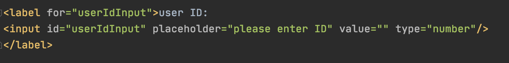 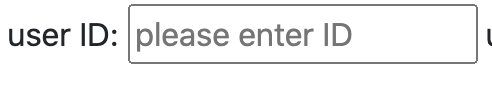

## Formulare - checkbox Element

Elements of type checkbox are rendered by default as boxes that are checked (ticked) when activated, like you might see in an official government paper form.

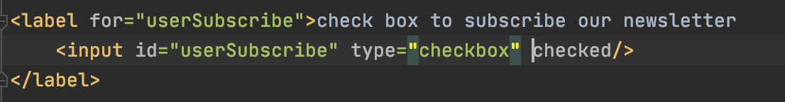 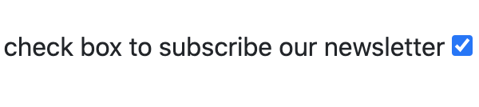

## fetch

- fragt Daten aus dem BackEnd (über eine URL) ab
- fetch läuft immer erfolgreich ab bzw. man bekommt immer ein Response in Form einer "promise" zurück
- nach dem fetch läuft das Script automatisch weiter --> .then / await --> wartet auf Antwort vom fetch
- "async" --> wird nicht sofort ausgeführt
- "await" --> wartet auf response vom fetch und läuft dann erst weiter
- "await" funktioniert immer nur in einer async function

Holt Daten vom Server:
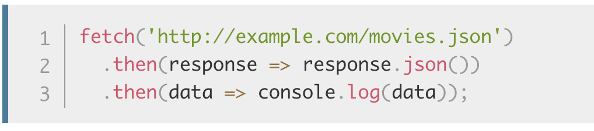

Sendet Daten zum Server:
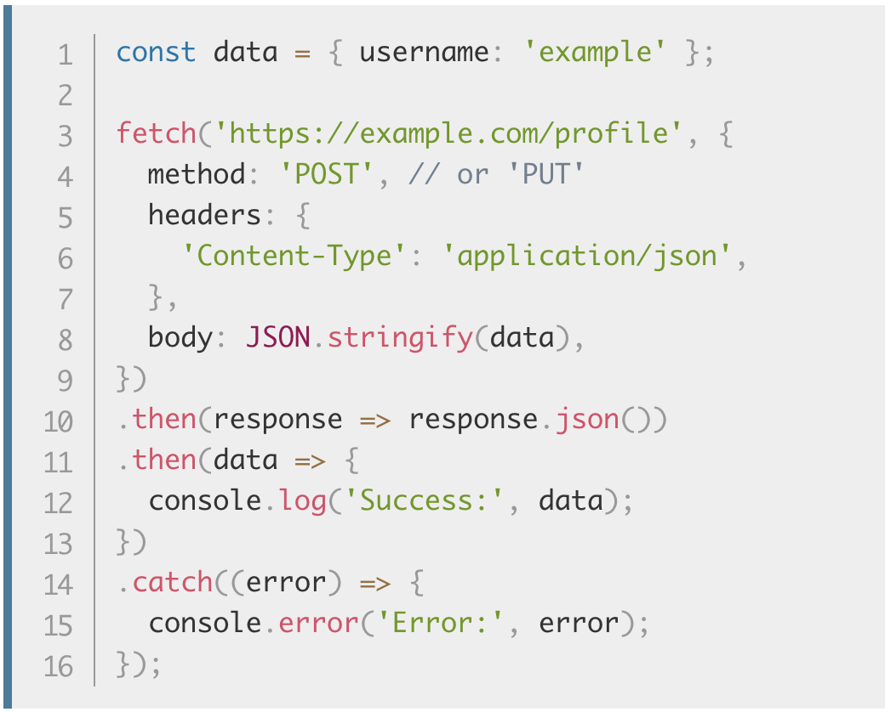

Fabians Beispiel:
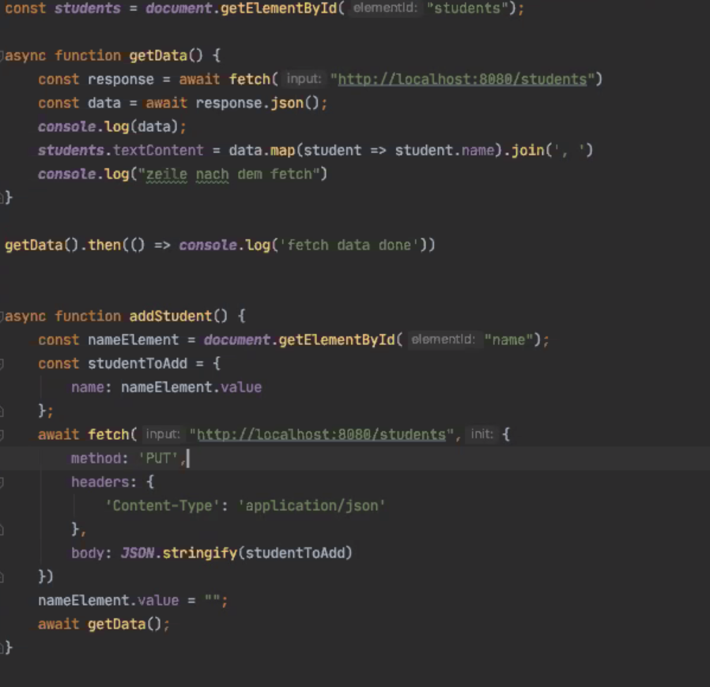

## Resources

- input elements:
https://developer.mozilla.org/en-US/docs/Web/HTML/Element/input

- Javascript Wikipedia: https://javascript.info/

- fetch: https://developer.mozilla.org/en-US/docs/Web/API/Fetch_API/Using_Fetch

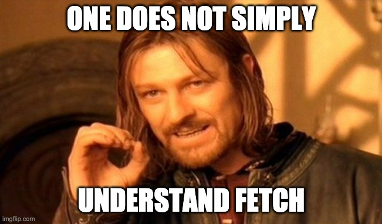
