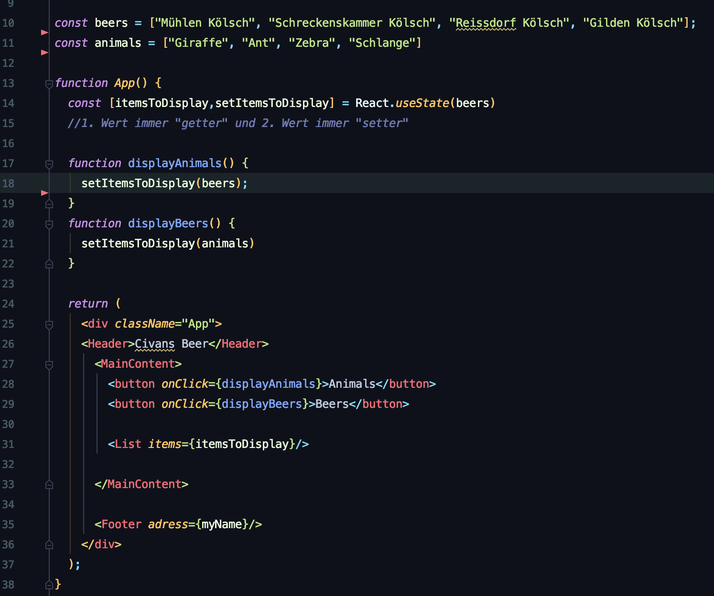

### Protokoll 15.06.2020

# React library Introduction
 

  - React rerendert ('updated') nur den Teil des Userinterfaces, welcher wirklich verändert wurde.
  - React wurde entwickelt von Facebook.
  - React läuft als single-page-application, d.h. die Seite als Ganzes wird i.d.R. nicht neu gerendert, sondern bloß ihre Einzelteile!
  - Erweitert JavaScript durch quasi HTML-Syntax im sogenannten JSX-Format.

## React SETUP & Getting Started
### 1. Erstelle React App
 `npx create-react-app react-intro`

 - legt starter code an, welcher eine Art “default” App ins Leben ruft
 - npm verwaltet code-Pakete (node package manager)
 - npx führt scripte aus, die in der entsprechenden NPM-Cloud liegen
 - “react-intro” ist in diesem Fall der Name der App (am Ende des Befehls)

### 2. Gehe in das Verzeichnis
 - `cd react-intro`

### 3. Starte die React-App
 - `npm start`
 - zum Beenden des Prozesses im Terminal –> Control+C 

### 4. Starter Code
- App.css und logo.svg können bedenkenlos aus dem StarterCode entfernt werden

### 5. Ordner-Struktur
 - es bietet sich an "components"-Ordner in src zu erstellen
 - components werden wie Java-Klassen immer groß geschrieben z.B. "Header.jsx"
 - Eine lose Konvention: Zu jeder component.jsx, eine component.css (und später noch eine testComponent.css) erstellen.
  
### 6. Pass de Props! 
 - Components rufen sich je nach Bedarf gegenseitig auf 
 - Dafür müssen diese - je nach Bedarf - zu Beginn jeder Komponente importiert werden (s. "import ... from ..." auf sämtlichen Screenshots).
 - Sogenannte "properties" (i.d.R. einfach nur 'props') werden gepassed von parent Components zu child Components.

#### Hier ein Beispiel einer von oben nach unten erfolgenden, hierarchischen Weitergabe der props:
 1. In der App-Component wird die List-Component aufgerufen und mithilfe des Attributs "items" (welches in der List-Component selbst definiert ist), werden alle im Array "beers" vorhandenen Werte durchgereicht.
 
 2. In der List Component werden die props empfangen (ganz oben, erste runde Klammer) und über die geschweifte Klammer ({props.items...}) aufgerufen. Mithilfe des Map befehls wird jeder Wert in beers nacheinander angesprochen. Jeder Durchlauf im Rahmen der .map-Funktion erzeugt nun ein neues ListItem-Element auf Basis der ListItem Component. 
 Wichtig: ListItem erwartet ein Attribut mit dem Namen "itemName", mit welchem er diese Property empfängt.
 
 3. Hier das gleiche Spiel erneut. ListItem empfängt die props und reicht sie weiter. Mit jedem Aufruf wird ein weiteres "li"-Element dynamisch erzeugt.

 **Additional**: Eine weitere Möglichkeit zum "passen" von props ist, dass das .children Element (oder auch der Children-Pfad?) nachschaut, welche Werte beim Aufruf der Component (in diesem Fall Header) eingeschlossen werden von dem entsprechenden Tag (s. Screenshot bei Kapitel 6.1. - in diesem Fall "Civans Beer").

### 7. Styling

 - jede Component erhält ein eigenes .css file 
 - z.B. List.jsx --> List.css

- Inside the List.css

- wichtig: Import erfolgt direkt (nicht nur eine "Funktion"/Component)
- className="List" wird von List.css angesteuert (aufgrund von ".List" inside of List.css)

### 8. state

1. Über den in Zeile 14 aufgerufenen Code werden React state's initialisiert. Der erste Parameter der const (itemsToDisplay) entspricht dabei dem aktuellen "zwischengespeicherten" Wert (könnte man auch als "getter" bezeichnen). 
2. Der zweite Parameter setzt den jeweiligen Wert in "itemsToDisplay". Dieser "setter" lässt etwa über eine Funktion initialisieren (s. Zeile 17 - 22)
3. Mithilfe von Button onClick lassen sich nun die beiden "setter"-Funktionen aufrufen.
4. Die Darstellung der Item-Liste erfolgt nun über die Abfrage des ersten Parameters "itemsToDisplay" in Zeile 31.

### 9. Exkurs - React-Theorie

- package.json vergleichbar mit der .POM in JAVA
- index.html ruft `

` auf.
- index.js importiert App.js und stellt React-App für “div” mit “root”-ID zur verfügung
- App.js entspricht (zumindest jetzt am Anfang) dem Code der React Startseite	
- ClassName statt class (also im Vergleich zur Verwendung klassischer "HTML"-Tags)

