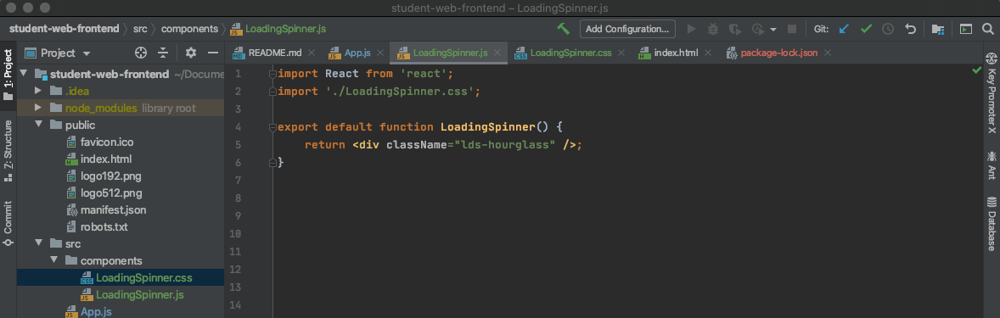

# 17.06.2020, Mittwoch

### 9:00 Uhr - Start Week6 Day3

## Anwesenheit 


## Tagesablauf
- 9:00 Uhr: Wiederholung/Protokoll-Review
- 9:30 Uhr: Fetch am Beispiel "Marwins animalArray"
- 12:30 Uhr: Fetch mit useEffect-Hook am Beispiel "Fabians Student DB" (Part 1)
- 13:00 Uhr: Mittagspause
- 14:00 Uhr: Fetch mit useEffect-Hook am Beispiel "Fabians Student DB" (Part 2)
- 16:30 Uhr: Key-Attribut
- 17:00 Uhr: Einführung Material-UI

## Fetch am Beispiel "Marwins animalArray"
### Ziel der Übung
Zuvor wurde auf die nötigen Daten für die (beispielhafte) React-Animal-Application aus einem lokal definierten Array zugegriffen.
Um näher an der Realität zu sein, sollen in der Übung Daten von "außerhalb" gefetcht werden.

### Vorgehensweise
- Bisherigen Array in eine .json-Datei ausgelagern und notwendige Formatänderungen vornehmen, um JSON-Code zu erhalten
- One-Click-Hoster nutzen, um eine URL zum späteren Fetchen zu generieren. Dazu z.B. auf jsonbin.io  den Inhalt der .json-Datei einfügen, 
den jsonbin auf "Public" umstellen und auf "Create new JSON" klicken. Es wird eine URL als API generiert - diese kopieren.


- In der Animal-Application eine Fetch-Funktion anlegen und als Input die kopierte URL mitgeben. Anschließend die Fetch-Funktion überall aufrufen, wo Daten über die API geholt werden sollen (hier: beim Klick auf den Button "Bisons" bzw. "Wolves").
Lösung s. Screenshot (für vollständiges Vorgehen inkl. Erweiterung um einen "Random-Animal-Button" s. Zoom-Record):


## useEffect-Hook am Beispiel "Fabians Student DB"
### Was ist der useEffect Hook?
"Um sogenannte Seiten-Effekte zu implementieren, gibt es den useEffect()-Hook. Seiteneffekte sind im Falle von React alles, was nicht unmittelbar das Rendern von UI-Komponenten betrifft, wie z. B. Console-Ausgaben, Netzwerk-Requests, Event-Handler etc.
Die grundlegende Syntax des useEffect()-Hooks ist dabei folgende:
```
useEffect(callback, dependencyArray)
```
Der Callback ist der Seiteneffekt, der ausgeführt werden soll. Das Dependency Array kann verschiedene Werte haben:

- (kein Wert) = Immer ausführen
- [] = Einmal bei Komponenten-Start ausführen
- [a, b] = Immer, wenn sich eine der Variablen a oder b geändert hat (wird per Referenz-Vergleich mittels Object.is() ermittelt), ausführen" 
(Quelle: https://www.informatik-aktuell.de/entwicklung/programmiersprachen/react-hooks-eine-einfuehrung.html)

### Anwendungsbeispiel Student DB   

#### Hintergrund
Ohne Nutzung eines entsprechenden useEffect-Hooks würde eine Fetch-Funktion jedes Mal getriggert werden, wenn sich State oder Props ändern.
Besser ist aber, wenn die Daten nur **einmal** über die Fetch-API geholt werden, anstatt jedes Mal, wenn sich z.B. durch einen Button-Klick der aktuelle State ändert.
Mit Hilfe des useEffect-Hooks und seines Dependency Arrays kann dies erreicht werden.

#### Initialanlage des useEffect-Hooks


In diesem Beispiel ist die Fetch-Funktion loadStudents() ein Seiteneffekt (aus "React-Sicht"). Der Dependency Array ist leer, 
d.h. der Fetch wird hier nur ein einziges Mal bei Komponentenstart ausgeführt.

#### 1. Ergänzung: Weiterer State als "Ladestatus"


Mit ```const [fetchState, setFetchState] = useState('')``` soll der Ladestatus wiedergegeben werden. Innerhalb des useEffect-Hooks wird der Status initial auf ```'LOADING'``` gesetzt,
nach erfolgreicher Ausführung der Fetch-Funktion loadStudents() auf ```'SUCCESS'``` oder aber bei Misserfolg der Ausführung mit ```'FAILED'``` abgefangen.

Als Grundlage dafür wird in die Fetch-Funktion selbst mit 
```
if(response.status !== 200) { 
throw new Error('Fetch failed') 
} 
```
eine Exception eingebaut, um Aufschluss über Erfolg oder Misserfolg des Fetchs zu geben.

Im Return-Teil der App-Funktion werden folgende Codezeilen hinzugefügt:
```
{fetchState === 'LOADING' && <LoadingSpinner />}
{fetchState === 'FAILED' && <div>Data fetch failed!</div>}
```
Bedeutung: Solange (&&) der fetchState auf ```'LOADING'``` steht, wird ein Loading Spinner (s. nächster Abschnitt) als Platzhalter angezeigt.
Solange der fetchState auf ```'FAILED'``` steht, wird der Text ```Data fetch failed!``` angezeigt.

#### 2. Ergänzung: Loading Spinner



Bei dem Loading Spinner handelt es sich um einen Platzhalter, der angezeigt wird, solange das Laden der Daten anhält. 
Der Spinner wird in einer separaten Komponente mit einer entsprechenden CSS-Klasse definiert; die CSS-Syntax kann 
z.B. von https://loading.io/css/ kopiert werden. 

#### 3. Ergänzung: Such-/Eingabefeld und Einbindung in useEffect


Im Backend wurde bereits eine Studentensuche implementiert (Zugriff über ```"http://localhost:8080/students?query=" + query``` als entsprechenden query-Parameter).
Mit ```<input onChange={(event) => {setQuery(event.target.value)}} />``` wird ein Eingabefeld definiert, dessen Inhalt den o.g. query-Parameter
widerspiegelt. Der Data-Fetch soll von der query-Eingabe abhängig gemacht werden. Dazu wird query der Fetch-Funktion als Parameter mitgegeben
und die o.g. URL als Fetch-API eingetragen:
```
function loadStudents(query) {
return fetch("http://localhost:8080/students?query=" + query)
...
```
Außerdem wird ein neuer State definiert: ```const [query, setQuery] = useState('');``` und der aktuelle State wird in den 
Dependency Array des userEffect-Hooks eingetragen. Dadurch wird die Ausführung der Fetch-Funktion von query abhängig gemacht.
Mit Trigger des Input-Field-Events (durch Nutzereingaben) wird der State neu gesetzt.

#### Ergebnis im Frontend (nach Styling)
Initial werden alle Students aus der Student DB aufgelistet:


Nach Eingabe des Buchstaben „H“ als Query-Parameter in das Suchfeld werden nur noch Students mit „H“ angezeigt:


## Key-Attribut
- Angenommen, es gibt in JS eine Liste, die mehrere Elemente enthält (z.B. die Studenten Caro und Frank) und an einem der Elemente wird etwas verändert (bei Caro wird ein Anführungszeichen hinzugefügt)
- Bei der Überführung der Liste ins DOM kann React dann nicht sofort erkennen, welches Element der „Zielliste“ angepasst werden muss. 
Um eine schnelle Zuweisung zu gewährleisten (und damit eine bessere Performance), ist es daher üblich, den einzelnen Elementen ein Key-Attribut mitzugeben (z.B. in Form einer ID).
- Some amazing artwork:


- Nochmal in anderen Worten: 
"Keys help React identify which items have changed, are added, or are removed. 
Keys should be given to the elements inside the array to give the elements a stable identity. 
The best way to pick a key is to use a string that uniquely identifies a list item among its siblings. 
Most often you would use IDs from your data as keys:" (Quelle: https://reactjs.org/docs/lists-and-keys.html)
```                
const todoItems = todos.map((todo) =>
<li key={todo.id}>
{todo.text}
</li>
);
``` 

## Einführung Material-UI
- stellt in einem Package fertige Komponenten zur Verfügung, die man sich dann in seinen Code importieren kann, z.B. Buttons
- für unterschiedliche Frameworks (React, Angular, Vue, ...) gibt es unterschiedliche Material-UI-Packages
- es wird viel Wert auf User Experience und Usability gelegt, dies kommt u.a. in den diversen verfügbaren Surface-Komponenten zum Vorschein 
- Installation über den Terminal (mit npm): 
```
npm install @material-ui/core
```
- Quick start: Button erstellen mit Material-UI:
```
import React from 'react';
import ReactDOM from 'react-dom';
import Button from '@material-ui/core/Button';

function App() {
  return (
    <Button variant="contained" color="primary">
      Hello World
    </Button>
  );
}

ReactDOM.render(<App />, document.querySelector('#app'));
```
- Zwecks Responsiveness wird empfohlen, den folgenden meta-Tag in das Head-Element des DOM einzubinden:
```
<meta
  name="viewport"
  content="minimum-scale=1, initial-scale=1, width=device-width"
/>
```

## Resources
- „Fake“-Online-Server/One-Click-Hoster, um Daten auf die Schnelle zu hosten: 
    - https://jsonbin.io/
    - https://my-json-server.typicode.com
- Alles über Fetching und Hooks:
  - https://www.robinwieruch.de/react-hooks-fetch-data
  - https://www.robinwieruch.de/react-fetching-data
  - https://blog.bitsrc.io/fetching-data-in-react-using-hooks-c6fdd71cb24a
  - https://dev.to/savagepixie/fetching-data-with-react-hooks-2mc5
  - https://scotch.io/tutorials/create-a-custom-usefetch-react-hook
- useEffect-Hook: https://reactjs.org/docs/hooks-effect.html
- Free loading spinners: https://loading.io/css/
- Key-Attribut: https://reactjs.org/docs/lists-and-keys.html
- Material UI: 
  - https://material-ui.com/ (im Kapitel Component API gibt es Infos über die Props und Customizing-Möglichkeiten für die einzelnen Komponenten)
  - https://material-ui.com/getting-started/templates/blog/# (Blog-Template zwecks Inspiration)

