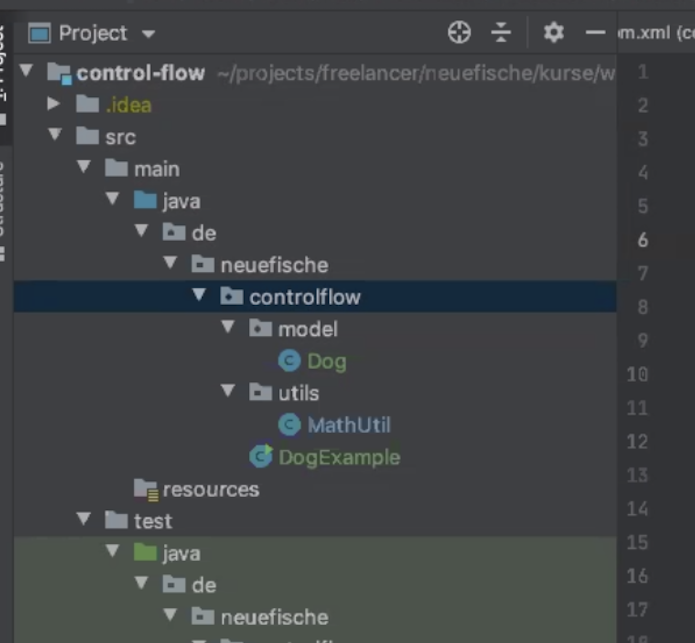
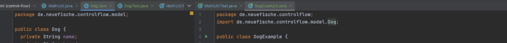

git# 18.05.2020, Dienstag

### 9:00 Uhr - Week2 Day1

## Anwesenheit

## Tagesablauf
- 9:00  **1.Wiederholung** Passwortvalidierung & Maven Test
- 9:30  **2.For-Loop** - Theorie & Praxis
- 11:00 **3.While-Loop** - Theorie & Praxis
- 11:30 **4.Arrays** - Theorie & Praxis
- 12:45 **5.Classes** Theorie
- 13:00 **Mittag**
- 14:00 **5.Classes** Praxis
- 15:00 **6.Getter&Setter** 
- 16:00 **7.Konstruktoren** / **packages** / **Sichtbarkeiten**
- 17:00 **8.Abschlussaufgabe**

##1. Wiederholung Maven Test mit Passwortvalidierung
  Reihenfolge:  
    1.New Project with Maven  
    2. .POM datei ergänzen (copy the dependency code + change Java version + Refresh)  
    3. Testfile erzeugen aus der Java Class mit Command + Shift + T  
    4. @Test vor Beginn der Testmethode  
    5. @Display "..." für Testbeschreibung (optional)    
    6. Maven Konvention // GIVEN (Variablendeklaration) //WHEN (Variable in die zu testende Java-Methode passen) //THEN (AssertEquals (expected, result))  
    7. i.d.R. mehrere Test-Methoden für mehrere Ausgänge testen

## MAVEN-Test Beispielcode

    //TESTMETHODE
    public class PasswordValidationTest {
    
      @Test  //TEST 1
      @DisplayName("validate should return true when password is valid")
      public void checkValidPassword(){
        //GIVEN
        String password = "s23f$f2a";
    
        //WHEN
        boolean validate = PasswordValidation.validate(password);
    
        //THEN
        assertTrue(validate);
      }
    
      @Test  //TEST 2
      @DisplayName("When Password length is smaller than 8 the password should be invalid")
      public void checkPasswordMinLength(){
        //GIVEN
        String password = "s23f$f2";
    
        //WHEN
        boolean validate = PasswordValidation.validate(password);
    
        //THEN
        assertFalse(validate);
      }

## Password-Validation Beispielcode
      
    public class PasswordValidation {
        public static boolean validate(String password) {
            if (password.length() <= 7) {
              System.out.println("not long enough");
              return false;
            }

    if(!password.matches(".*\\d.*")){
      System.out.println("No number");
      return false;
    }

    if(!password.matches(".*[a-z].*")){
      System.out.println("No lower case chhaaracter");
      return false;
    }

    return true;
  }
}
   

   
## 2. FOR - LOOP Theorie
 
 Klassischer for-loop  
 
 
                    for (int i = 0; i < 100; i++) {
                       System.out.println("count: " + i)
                     }

    --> for (STARTPUNKT, ABBRUCHBEDINGUNG, AKTION NACH JEDEM DURCHLAUF) 
            {
                     STATEMENT
            }
            
## FOR LOOP - Fakultät berechnen
       public static int facResult(int factorial) {
       
        int n = 1;
        
        for (int i = 2; i <= factorial; i++) {

          n = n * i;

        }

        return n;
    }

## 3. WHILE-LOOP Theorie

	int i = 0;
	While (i < 100) {
    	System.out.println("count: " + i)
	i ++
 	}
 	
    --> while (Solange Bedingung gültig läuft der Loop)    
    --> Achtung: Gefahr für "infinite"-Loop bei while erhöht..
    --> Deshalb: Im Loopstatement Abbruchbedingung erfüllen 
        oder durch Loop-interne If Konstruktion mit break-Befehl aus Loop ausbrechen.

    
## WHILE - LOOP Fakultät berechnen
	public static int facWhile(int factorial) {

        int i = factorial;
        int result = 1;
        while(i > 0){
         result *= i;
         i--;
        }
        return result;
    }

## Fakultät Maven Test FOR & WHILE

    import org.junit.jupiter.api.Test;
    import static org.junit.jupiter.api.Assertions.*;

    class facultyTest {

    @Test
    public void FacTest () {

        //GIVEN
        int facVal = 5;

        //WHEN
        int result = faculty.facResult(facVal);

        //THEN
        assertEquals(120,result);

    }
}
   

## 4. ARRAYS
#### Was ist ein Array? 
   - Ein Array ist eine Sammlung von Elementen eines Types (String, int etc.)
####Array-Eigenschaften
   - Ein Array hat eine feste Größe (länge) ab dem Zeitpunkt nachdem er definiert wurde.  
   - Ein Array muss erzeugt werden, bevor er verwendet wird.  
   - Die Werte in einem Array lassen sich über deren Indexposition [..] "ansteuern".  
   - Arrayindex liegt immer zwischen 0 und der Arraylänge-1 (array.length-1)  
   - Arraystellen ohne gesetzten Wert => null

### Beispiel Array Code
        String[] someArray = new String[10];
                    
        someArray[0] = "value";
                    
        System.out.println(someArray[0]);

### WICHTIG: Beginnt immer bei Stelle 0. Also "erste Stelle" ist = [0], letzte Stelle bei einem 10er Array ist [9]
--> Also Arrayrange eines Arrays mit .length = 10 --> [0]-[9]

## ARRAY AUFGABE - Java Class

### METHODE zum Erzeugen eines 10er Arrays: 
    public static String[] getBookTitle() {
        String[] bookTitle = new String[10];
        bookTitle[0] = "Da holy Bible";
        bookTitle[1] = "Das Kapital";
        bookTitle[2] = "Leiden des jungen Werther";
        bookTitle[3] = "Siddharta";
        bookTitle[4] = "Die unerträgliche Leichtigkeit des Seins";
        bookTitle[5] = "Der Name der Rose";
        bookTitle[6] = "Die Blechtrommel";
        bookTitle[7] = "Die Verwandlung";
        bookTitle[8] = "1984";
        bookTitle[9] = "Der Fremde";
        return bookTitle;
    }

### METHODE For loop zum "befüllen"/pushen eines neuen Arrays
     public static String[] getBookList(String[] bookTitle) {
            String[] bookList = new String[10];

        for (int i = 0; i < bookList.length; i++) {
            bookList[i] = bookTitle[i];
        }
        return bookList;
    }

### ARRAY Aufgabe - Maven Test

	@Test
    	public void BookListCheck() {
        //GIVEN
        int oneBookIndex = 3;
        String[] bookArray = AppMain.getBookList(AppMain.getBookTitle());
        //WHEN
        String result = AppMain.getBook(bookArray,oneBookIndex);
        //THEN
        assertEquals("Siddharta", result);
    }

## 5. CLASSES 

- Klassen werden genutzt, um Objekte zu erstellen mit dem "new"-Befehl.  
--> Idee dahinter: Kapselung von Logik und Daten  
--> Struktur und Definition einer neuen Klasse:     
        
          // Student.class 
		class Student { 
		    // Class Body - hier befindet sich der Inhalt der Klasse
		    }

		// MainApp - Datei 
		Student student = new Student(); //Erzeugen eines Objects mithilfe der Class "Student"

### Reihenfolge - Class Dateien erstellen und Objekte erzeugen
##### - neue Class Datei erstellen (1)
##### - Konvention sind Getter und Setter Methoden: Bsp. Student (2)
##### - Mithilfe der Setter Methode (z.B. setName) lassen sich die Attribute(Klassenvariablen) eines Objektes ändern, zB. falls schon durch Konstruktor gesetzt worden, oder können mit den Settern erstmalig gesetzt werden.
##### - Mithilfe der Getter Methode (z.B. getName) lassen sich Objektinformationen abfragen (4)

#### CLASSES - CLASS FILE Student Example 
    
    public class Student {                  //(1)

    private String name;                    //Definition der Variablen 
    private int age;
    private double average;

    public void setName(String name) {      //Definition Set-Methode (2)
         this.name = name;
    }
    public String getName() {               //Defintion Get-Methode (2)
        return name;
    }

    public void setAge(int age) {           //Definition Set-Methode (2)
        this.age = age;
    }
    public int getAge() {                   //Definition Get-Methode (2)
        return age;
    }

    public void setAverage(double average)  //...
    {
        this.average = average;
    }
    public double setAverage() {            //...
        return average;
    }
}

#### CLASSES - Main Methodfile - Student Example

        Student student1 = new Student(); // Create new Object student1 from Class Student
        student1.setName("Paul");         // (3)setName (zuvor definiert)
        student1.setAge(26);              // (3)setAge  (...)
        student1.setAverageGrade(1.9);    // (3)..

        Student student2 = new Student();
        student2.setName("Hannah");
        student2.setAge(25);
        student2.setAverageGrade(1.4);

        Student student3 = new Student();
        student3.setName("Fred");
        student3.setAge(29);
        student3.setAverageGrade(3.0);

        System.out.println(student1.getName());         //--> Output "Paul"
        System.out.println(student2.getAge());	        //--> Output  25
        System.out.println(student3.getAverageGrade()); //--> Output  3.0
### WICHTIG: mit `this.` greift man immer auf das aktuelle Objekt zu und ruft ausschließlich die DARIN definierten Variablen und auch Methoden auf. 

#### Ergänzend dazu: `this.` benutzt man, um die Objekt-Variablen (welche ja auch die Klassenattribute/-variablen sind) optisch identifizieren und von den übergebenen Parametern unterscheiden zu können, da diese oft den gleichen namen haben:
                    
                    name = name;
                    
                    vs.
                    
                    this.name = name;
                    
#### Im 1. Fall wäre nicht eindeutig, welcher Eintrag den Parameter darstellt und welcher das Klassenattribut (was wird hier wem zugewiesen?). Im 2. Fall kann man das sofort unterscheiden.

### CLASSES - Maven Testfile - Student Example   
--> Maven Test Code für zuvor definierte Student-Klasse

    @Test
        public void StudentTestName() {
            //GIVEN
            String name = "Paul";
            //WHEN
            Student testStudent = new Student();
            testStudent.setName(name);
            //THEN
            assertEquals("Paul", testStudent.getName());
        }

    @Test
    public void StudentTestAge() {
        //GIVEN
        int age = 25;
        //WHEN
        Student testStudent = new Student();
        testStudent.setAge(age);
        //THEN
        assertEquals(25, testStudent.getAge());
    }

    @Test
    public void StudentTestAverage() {
        //GIVEN
        double average = 1.5;
        //WHEN
        Student testStudent = new Student();
        testStudent.setAverageGrade(average);
        //THEN
        assertEquals(1.5, testStudent.getAverageGrade());
    }
    

## 7. KONSTRUKTOREN
		
WICHTIG: Konstruktoren müssen denselben Namen wie die darüberliegende Klasse tragen! 
Existiert in der Klasse kein Konstruktor, generiert der Kompiler automatisch einen. 
Es handelt sich dabei um einen leeren Standard-/Default-Konstruktor. Eine Klasse kann 
entweder keinen (Default-Konstruktor), einen oder meherer Konstruktoren besitzen, die 
sich über die Anzahl der Parameter unterscheiden müssen. Konstruktoren besitzen 
keinen Rückgabetyp.

	class Student { 
	private String name;            //Definition der Klassenvariablen
	private int age;

	Student(String name, int age){	//Definition der Konstruktor-Methode
 	this.name = name;				//Zuordnung der Variable name 
	this.age = age;					//Zuordnung der Variable age
	}

### 7.1 packages 

Packages? packages lagern Daten - etwa Klassen,Konstruktoren usw. in verschiedene Unterordner (z.B. Models, Utils, Service etc.) aus.

- Auslagern über Rechtsklick - New - package  
    --> Neuen Ordner anlegen und Klassen, Konstruktoren in die entsprechenden Ordner legen

- Ziel: Strukturierung und Kapselung des Projekts  
- Hier eine beispielhafte package-Strukturierung eines Projektes

##### Wichtig: Die neu strukturierten Klassen müssen bei Gebrauch gegenseitig importiert werden.
- Hier ein beispielhafter Export (package de.neue.....) und Import (import de.neue....) eines packages 

## 7.2 SICHTBARKEITEN

- ## private
	- nur in eigener Klasse
	- wenn möglich immer private
	
- ## protected (default)
	- Klassen im gleichen Paket (Ordner)
	- eher selten verwendet
	
- ## public
	- Global sichtbar
	- möglichst verhindern

### 7.3 Static
`static` bedeutet, dass die `static` deklarierten Methoden NICHT an ein Objekt gebunden sind, 
sondern auch ohne explizites Objekt aufgerufen werden können (#Klassenmethoden). Mit `static` 
kann man also unabhängig von irgendwelchen Klassen und Objekten irgendwelchen Methoden deklarieren.
    
//Angabe ohne Gewähr :p   
	- Wenn möglich static vermeiden, insbesondere bei Objektorientierter Programmierung  
	- Ausnahmen sind hierbei allerdings Konstanten (nicht veränderbare Variablen)

### Exkurs 
 - Aufgabe toString Methode in Student-Klasse

        //toString METHODE in Student-Klasse
            public String toString() {
            return "Name: " + name + " Age: " + age + " Average grade: " + average;
            }
                    
            //toString Methode in MainApp
            System.out.println(student1.toString());
            System.out.println(student2.toString());

        Output1: "Name: Paul Age: 26 Average grade: 1.9"
        Output2: "Name: Hannah Age: 25 Average grade: 1.4"
