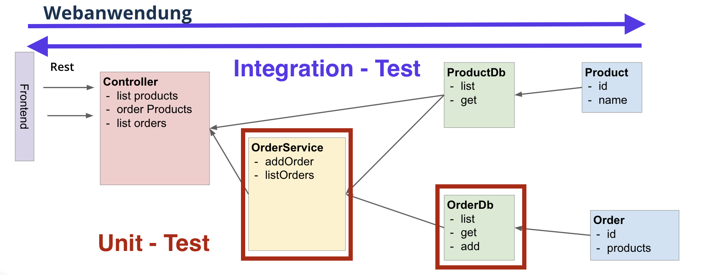
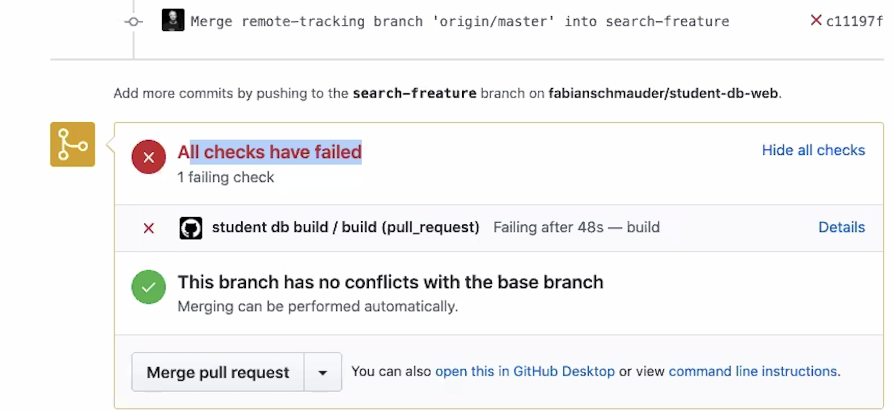

# Donnerstag, 28.05.2020

### 9:00 Uhr - Start Week 3, Day 4

## Anwesenheit 


## Tagesablauf

- 09:00 Uhr: Protokoll-Review
- 09:30 Uhr: "Wie gehts euch” - Runde mit Anne
- 10:00 Uhr: Theorie und Übungen zu Spring Testing
- 13:00 Uhr: Mittagspause
- 14:00 Uhr: Unit-Tests und Mockito
- 14:50 Uhr: Maven 2.0
- 15:45 Uhr: Testing in GitHub
- 16:20 Uhr: Enums und Java Date/Time API
- 17:00 Uhr: IntelliJ vs. VisualCode

---
#### Spring Testing

- Es gibt 2 Arten von Tests: Integration und Unit Tests.



| Integration - Test                                                  | Unit - Test                           |
|---------------------------------------------------------------------|---------------------------------------|
| - Das komplette Zusammenspiel von Softwarekomponenten wird getestet | - Einzelne Klassen werden getestet    |
| - Server muss komplett hochgefahren werden - kostet Ressourcen      | - schnelles Testen möglich            |
| - Wenn ein Test fehlschlägt, schlagen die anderen evtl. auch fehl   | - Tests laufen unabhängig voneinander |

- Beide Test-Verfahren sollten implementiert werden
- Bei einem Integration - Test sollte nur "in eine Richtung" getestet werden, da sonst zu viel Logik in einem Test vorhanden ist.
- Beispiel Integration-Test: über ein Put-Request wird ein Student in der StudentDb angelegt
```
@SpringBootTest(webEnvironment = SpringBootTest.WebEnvironment.RANDOM_PORT)
class StudentControllerTest {

  @LocalServerPort
  private int port;

  @Autowired
  // https://docs.spring.io/spring-boot/docs/current/api/org/springframework/boot/test/web/client/TestRestTemplate.html
  private TestRestTemplate restTemplate;

  @Autowired
  private StudentDb studentDb;

  @BeforeEach
  public void resetDatabase() {
    studentDb.clearDb();
  }
```
- @SpringBootTest startet den Server auf einem zufälligen Port 
- RestTemplate nutzen, um Endpunkt aufzurufen (über @Autowired erstellt Spring direkt ein RestTemplate)
- @BeforeEach führt die nachfolgende Methode vor jedem Test aus &rarr; clearDb() - Methode geschrieben, damit Student nach erstem Testdurchlauf aus Datenbank entfernt wird.
```
  @Test
  public void putStudentShouldAddStudentToDatabase() {
    //GIVEN
    HttpEntity<Student> requestEntity = new HttpEntity<>(new Student("1", "Frank", 22, "uni1"));

    //WHEN
    ResponseEntity<Student> putResponse = restTemplate.exchange("http://localhost:" + port + "/students", HttpMethod.PUT, requestEntity, Student.class);

    //THEN
    assertEquals(HttpStatus.OK, putResponse.getStatusCode());
    assertEquals(new Student("1", "Frank", 22, "uni1"), putResponse.getBody());
    assertTrue(studentDb.getStudents().contains(new Student("1", "Frank", 22, "uni1")));
  }
```
- Es wird überprüft, ob
  - der Http Status = OK ist,
  - putEsponse.getBody() einen Studenten zurückgibt,
  - der Student in der studentDb enthalten ist


- Bei einem Unit - Test wird nur die Funktionalität einer Klasse getestet
- Beispiel Test StudentDb:
```
class StudentDbTest {

  @Test
  public void addStudentShouldAddAStudentToTheDb() {
    //GIVEN
    StudentDb db = new StudentDb();
    Student studentToAdd = new Student("12", "Frank", 12, "uni1");

    //WHEN
    db.add(studentToAdd);

    //THEN
    List<Student> students = db.getStudents();
    Student studentToCheck = new Student("12", "Frank", 12, "uni1");
    assertTrue(students.contains(studentToCheck));
  }

}
```
---
#### Mockito

- [Mockito](https://site.mockito.org/) ist ein Mocking Framework, mit dessen Hilfe z.B. das Verhalten einer Datenbank imitiert werden kann.
- Im unten stehenden Code kann die Funktionalität der StudentService - Klasse unabhängig von der Funktionalität der StudentDb - Klasse getestet werden.
```
@Test
  public void findStudentByUniversity() {
    //GIVEN
    StudentDb studentDb = mock(StudentDb.class);

    when(studentDb.getStudents()).thenReturn(List.of(
        new Student("12", "Frank", 12, "uni1"),
        new Student("1", "Caro", 12, "uni2"),
        new Student("10", "Marwin", 32, "uni1"),
        new Student("3", "Alpay", 22, "uni3")
    ));
```
---
#### Maven 2.0

- Maven unterstützt den Anwender bei der Automatisierung möglichst vieler Schritte, insb. bei der Verwaltung von Abhängigkeiten

| pom.xml      | Beschreibung                                                                                             |
|--------------|----------------------------------------------------------------------------------------------------------|
| groupId      | Eindeutige Identifikation des Herstellers, zB. URL der Firma                                             |
| artifactId   | Name des zu erstellenden Artefakts. Die ID stellt die Grundlage für den späteren Auslieferungsnamen dar. |
| version      | 0.0.1 - SNAPSHOT (SNAPSHOT = Version in Bearbeitung. Nach Fertigstellung "SNAPSHOT" entfernen)          |
| dependencies | Abhängigkeiten eintragen, um Code von anderen Anbietern zu integrieren (z.B. Lombok, Hamcrest,...)       |

- Möglichst wenige Dependencies nutzen, da bei Java-Updates der Code evtl. nicht mehr kompatibel ist oder die Projekte nicht mehr geupdated werden.

- Maven Terminal-Befehle (auch zu finden rechts in dem Maven-Fenster unter "Lifecycle")

| Maven command | Beschreibung                                                                                     |
|---------------|--------------------------------------------------------------------------------------------------|
| mvn clean     | löscht den Target-Ordner                                                                          |
| mvn compile   | kompiliert den Quellcode --> direkt ausführbares Programm)                                       |
| mvn test      | kompiliert den Quellcode und Tests werden ausgeführt                                             |
| mvn package   | kompiliert den Quellcode, Tests werden ausgeführt und .jar Datei mit allen Klassen wird erstellt |
---
#### Testing in Github

- Man kann einstellen, dass in GitHub automatisch Tests ausgeführt werden, wenn Code ins Repository gepushed wird.
- Hierfür startet GitHub automatisch über Maven die Tests aus dem Test-Ordner
- Zur Aktivierung im Repository auf &rarr; Actions &rarr; Java with Maven &rarr; Set up this workflow klicken
- Standardmäßig wird der Test nur ausgeführt, wenn man in den master mergt. Wenn dies auch bei anderen Branches ausgeführt werden soll, "on:" auf "push" setzen.



---
#### Enums

- Kann erstellt werden durch Rechtsklick auf Zielordner &rarr; JavaClass &rarr; Enum
- Es wird eine eigene Klasse erstellt, in der nur Konstanten stehen.
- Konvention, dass Konstanten mit Großbuchstaben geschrieben werden
```
public enum AlarmStatus {
  GREEN,
  ORANGE,
  RED
}
```
- Enum kann wie ein Parameter in der Anweisung switch benutzt werden:
```
@Service
public class UniversityService {
(...)

  private final AlarmStatus alarmStatus = AlarmStatus.GREEN;

(...)

  public boolean isOpen() {
    return api.numberOfActiveInfections() <= getNumberOfAllowedInfections();
  }

  private int getNumberOfAllowedInfections() {
    switch (alarmStatus) {
      case RED:
        return 0;
      case ORANGE:
        return 1000;
      case GREEN:
        return 15000;
      default:
        return 0;
    }
  }
  ```
---

#### Java Date/Time API
- statische URL &rarr; Abfrage der Daten auf festgelegten Zeitraum
```
public int numberOfActiveInfections(){
    RestTemplate restTemplate = new RestTemplate();
    String url = "https://api.covid19api.com/total/country/germany?from=2020-05-24T00:00:00Z&to=2020-05-25T00:00:00Z";

    ResponseEntity<CovidApiCountryStats[]> responseEntity = restTemplate.getForEntity(url, CovidApiCountryStats[].class);
```

- Durch ```currentDate``` und der Wahl des richtigen Zeitformats (hier: ```DateTimeFormatter.ISO_LOCAL_DATE_TIME```) kann die URL und damit die Abfrage der aktuellen Zeiten dynamisch gestaltet werden
```
RestTemplate restTemplate = new RestTemplate();
    String currentDayFormatted = currentDate.atStartOfDay().format(DateTimeFormatter.ISO_LOCAL_DATE_TIME);
    String dayBeforeFormatted = currentDate.minusDays(1).atStartOfDay().format(DateTimeFormatter.ISO_LOCAL_DATE_TIME);


    String url = "https://api.covid19api.com/total/country/germany?from=" + dayBeforeFormatted + "&to=" + currentDayFormatted;

    ResponseEntity<CovidApiCountryStats[]> responseEntity = restTemplate.getForEntity(url, CovidApiCountryStats[].class);
```

#### Resources


- [Class TestRestTemplate](https://docs.spring.io/spring-boot/docs/current/api/org/springframework/boot/test/web/client/TestRestTemplate.html)
- [Assertions With Hamcrest](https://www.petrikainulainen.net/programming/testing/junit-5-tutorial-writing-assertions-with-hamcrest/)
- [Mockito](https://site.mockito.org/)
- [Java Date/Time API](https://www.baeldung.com/java-8-date-time-intro)