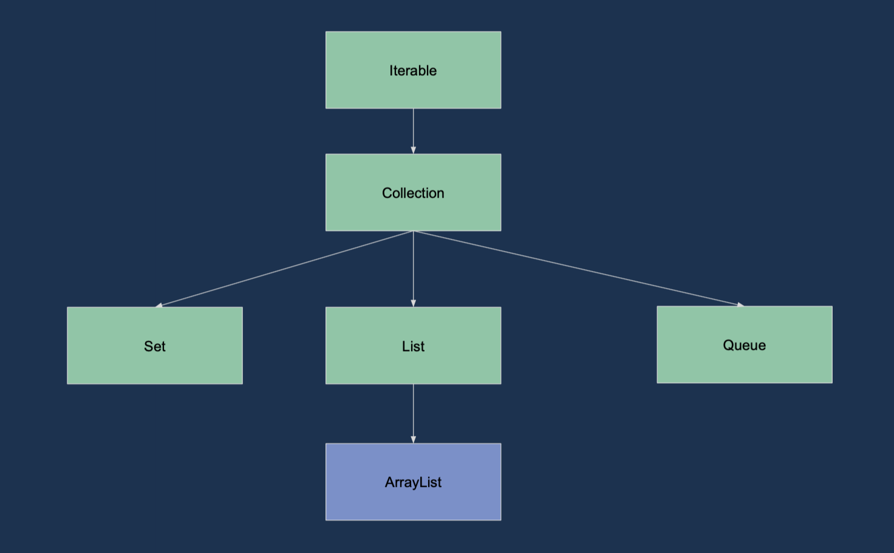

# 19.05.2020, Dienstag

### 9:00 Uhr - Start Week2 Day2

## Anwesenheit

## Tagesablauf
- 09:00  **1. Protokoll** 
- 09:30  **2. Besprechung der Übung von Montag**
- 09:50  **3. Besprechung in Teams**
- 10:35  **4. Erklärung der Übung von Montag** 
- 11:15  **Pause** 
- 11:30  **5. Bonusaufgabe**
- 12:10  **6. Objektorientierung - Paradigmen** 
- 13:00  **Pause** 
- 14:00  **7. Gruppenarbeit**
- 15:30  **8. Besprechung der Gruppenarbeit**
- 15:40  **9. Collections - ArrayList, HashSet**
- 16:00  **10. Gruppenarbeit**
- 17:00  **11. Besprechung der Gruppenarbeit**
- 17:10  **12. Praxisbeispiel ArrayList**

## Übungsaufgabe von Montag
  Erstelle eine Klasse Student DB mit folgenden Eigenschaften  
   1. Der Konstruktor nimmt einen Array von Studenten entgegen  
    
   2. Jeder Student hat einen Namen und eine Id
    
   3. Die Methode list gibt alle Studenten zurück
    
   4. Die Methode toString() gibt alle Studenten formatiert als String zurück  
    
   5. Die Methode randomStudent gibt einen zufälligen Studenten zurück   
    
   6. Schreibe eine add und deine remove Methode um Studenten hinzu zu fügen und zu entfernen
    
   7. Schreibe für alle Methoden bis auf randomStudent Tests
    
  Lösung: https://github.com/fabianschmauder/student-db

# Objektorientierung

#### Paradigmen
   - Encapsulation - Kapselung von Logik/Daten
   - Abstraction - Nur Vorgang sichtbar, nicht die Funktionsweise
   - Polymorphism - Objekt kann verschiedene Formen annehmen (Bsp.: Student = Biologiestudent/Chemiestudent)
   

## Encapsulation
   - Methoden
   - Klassen
   - Packages
## Abstraction
   - Methoden beschreiben nur was nicht wie
   - Interfaces Abstrahieren konkrete Klassen
  
      
    package model;
    
    // Student
    class Student { 
    	private String name;
    
    public Student(String name){
     this.name = name;
    }
    
    public String getName(){
     	return name;
    }
    
    public void setName(String name){
     	this.name = name;
    }
    }
    
    // in main 
    import model.Student;
    // ...
    Student student = new Student("name");
    
    System.out.println(student.getName());
    
    
## Interface (Polymorphism)
   - Interface definiert Signatur
   - Klassen können Interface implementieren
   - Signatur muss übereinstimmen
   - Typangabe der Variablen auch im Interface möglich

    public interface Student {
    String getCourse();
    }
                  
                  
    public class ComputerScienceStudent implements Student {
    public String getCourse() {
    return “Computer Science”;
    }
    }
    // Object creation
    Student student = new ComputerScienceStudent();
    
    
    // Method parameter
    
    String printStudentCourse(Student student) {
     	return "Course " + student.getCourse();
    }

            
# Collections

## ArrayList
   - Implementert Iterable
   - Generic Type < >
   - Zugriff über Index möglich
   - Länge über size()
   
   

       // Erzeugen
       ArrayList<Student> students = new ArrayList<Student>();
       
       // Hinzufügen
       students.add(new ComputerScienceStudent("Student"));
       
       // Zugriff
       System.out.println(students.get(0));
       
       // iterieren
       for (Student student : students) {
        	System.out.println(student.getName());
       }

