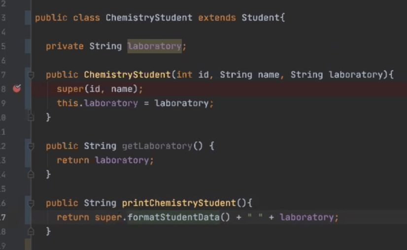
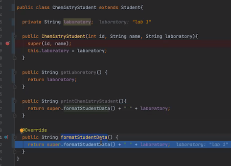
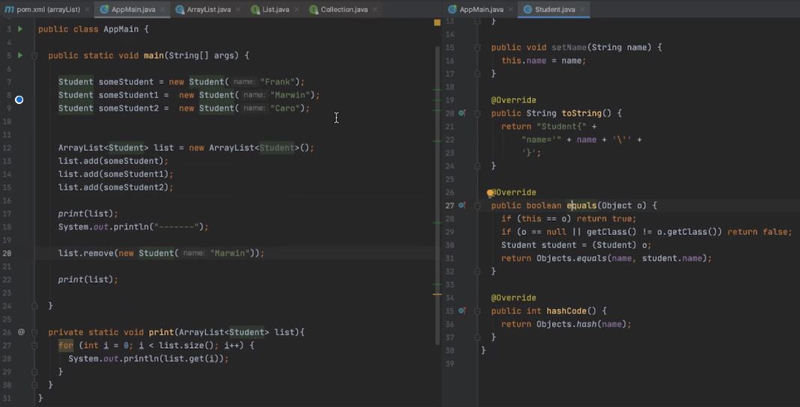

# 20.05.2020, Mittwoch

### 9:00 Uhr - Start Week2 Day3

## Anwesenheit 


## Tagesablauf

- 9:00 Uhr: Wiederholung/Protokoll-Review
- 9:30 Uhr: Polymorphie und Vererbung
- 10:30 Uhr: Aufgabe Vererbung
- 13:00 Uhr: Mittagspause
- 14:00 Uhr: Demo: Interfaces und Vererbung am Beispiel Cooking Service
- 14:30 Uhr: Collections in Java - ArrayList
- 15:00 Uhr: Aufgabe ArrayList
- 16:00 Uhr: Exceptions und Optional
- 16:45 Uhr: Aufgabe Exceptions und Aufgabe Optional

## Polymorphie
### Definition
„Von Polymorphie spricht man in Java beispielsweise, wenn zwei Klassen denselben Methodennamen verwenden, aber die Implementierung der Methoden sich unterscheidet. Häufig wird Polymorphie bei der Vererbung verwendet, d.h., dass einer Variablen nicht nur Objekte vom Typ der bei der Deklaration angegebenen Klasse zugewiesen werden können, sondern auch Objekte vom Typ der Kindsklassen. Dies funktioniert nur, weil jede Kindsklasse auch alle Methoden und Attribute ihrer Elternklassen implementieren muss. Somit ist gewährleistet, dass alle Kindsklassen über dieselben Methoden verfügen wie die Elternklasse. Die Methoden können jedoch unterschiedlich implementiert werden, man spricht hier vom "Überschreiben" der Methode.“ (Quelle: https://java-tutorial.org/polymorphie.html) 

### Beispiel
Die Kindsklassen BioStudent und ChemistryStudent sind im Prinzip verschiedene Ausprägungen der Elternklasse Student. Z.B. könnte eine Methode calculateAverageGrade aus der Elternklasse in BioStudent und ChemistryStudent jeweils unterschiedlich implementiert werden, wenn die Notenberechnung in den beiden Fächern voneinander abweicht. Dennoch wird in beiden Fällen derselbe Methodenname verwendet.

## Vererbung
### Definition
„Bei einer Vererbung in Java wird zwischen einer Super- und einer Subklasse unterschieden. Die Superklasse, auch Eltern- oder Basisklasse genannt, ist in der Regel eine Zusammenfassung von allgemeinen Attributen und Methoden unterschiedlicher aber ähnlicher Objekte. Die Subklasse, auch als Kindsklasse bezeichnet, bekommt von ihrer Superklasse sämtliche Attribute und Methoden vererbt. Desweiteren wird die Subklasse um eigene Attribute und Methoden erweitert. Man spricht hier von einer Spezialisierung der Subklasse von der Superklasse.“ (Quelle: https://java-tutorial.org/vererbung.html)

### Beispiel    
- Es gibt die Klasse Student mit den Attributen name und ID und einer Methode printStudentData zur Ausgabe der Attribute. 
- Eine Klasse ChemistryStudent wird erstellt, die die Klasse Student erweitert (extends).
- Durch diese Erweiterung erbt die Klasse ChemistryStudent die Eigenschaften und Fähigkeiten der Elternklasse Student.
- Mit dem Schlüsselwort super kann in der Kindsklasse auf die Elternklasse zugegriffen werden, z.B. beim Anlegen des Konstruktors (dabei muss der super-Konstruktor immer oben stehen und zusätzliche Attribute der Kindsklasse darunter) oder bei der Implementierung von Methoden.
- Screenshot: 



### Allgemeine Vererbungsregeln
- **@Override-Methoden:** Methoden aus der Elternklasse (hier Student) können in der Kindsklasse (hier ChemistryStudent) auch überschrieben werden, d.h. wenn ein Objekt der Klasse ChemistryStudent erstellt und darauf die entsprechende Methode aufgerufen wird, wird die Override-Methode anstatt der ursprünglich in Student implementierten Methode aufgerufen.
- Screenshot:



- Man kann bei Java immer nur **eine einzige** andere Klasse erweitern, z.B. kann die Klasse ChemistryStudent die Klasse Student erweitern, aber nicht zusätzlich die Klasse Person. Hintergrund: Wenn es z.B. sowohl in der Klasse Student als auch in der Klasse Person jeweils eine Methode mit dem Namen printData gäbe, wüsste das Programm nicht, welche Methode an die erbende Klasse weitergegeben werden sollte.
- Es kann beliebig viele „Vererbungsebenen“ geben. Beispiel: Die Klasse ChemistryStudent erweitert die Klasse Student, die ihrerseits die Klasse Human erweitert (ChemistryStudent erbt von Student, Student erbt von Human → dadurch erbt ChemistryStudent indirekt auch von Human).
- Auch Interfaces können voneinander erben

### Abstrakte Klassen und Methoden
- **Abstrakte Methode** = Methode, die in einer abstrakten Klasse deklariert, aber nicht implementiert wird. Die Implementierung erfolgt in den Klassen, die von der abstrakten Klasse erben.
- Nachteil: Von der abstrakten Klasse selbst können keine Objekte erzeugt werden, sondern nur von deren Kindsklassen.

### Interfaces vs. Vererbung/Vor- und Nachteile
- Ein Interface stellt nie eine Implementierung bereit (hier wird nur eine abstrakte Methode deklariert), bei einer „normalen“ Vererbung erfolgt in der Regel jedoch eine Implementierung in der Elternklasse.
- Vorteil von Vererbung: Es wird insgesamt weniger Code benötigt, da viele Methoden schon in der Elternklasse implementiert werden.
- Nachteil von Vererbung: Eine Klasse kann nur von einer einzigen anderen Klasse erben. Dafür kann eine Klasse aber mehrere Interfaces implementieren.

### Demo: Interfaces und Vererbung am Beispiel Cooking Service
s. Zoom-Record 

## Collections in Java - ArrayList
- Arrays sind aufgrund ihrer festgelegten Länge/Größe relativ unpraktisch, z.B. wenn man Array-Einträge hinzufügen oder entfernen möchte
- Praktischer ist die ArrayList, da bei deren Erstellung keine initiale Länge angegeben wird. Stattdessen passt sich die List-Länge dynamisch an den Programmverlauf an.
```
// Erzeugen
ArrayList<Student> students = new ArrayList<Student>();

// Eintrag hinzufügen
students.add(new ComputerScienceStudent("Student"));

// Eintrag entfernen
students.remove(someStudent);

// Länge der ArrayList ermitteln (analog zu .length bei Arrays)
students.size();

// Listeneintrag zu einem bestimmten Index ermitteln
students.get(index);

// Zugriff
System.out.println(students.get(0));

// iterieren
for (Student student : students) {
 	System.out.println(student.getName());
}
```

### Exkurs equals-Methode
Beispiel ArrayList mit drei Studenten:

- Ohne Implementierung der equals-Methode wird trotz list.remove-Ausführung der Student Marwin nicht aus der ArrayList entfernt, da das Programm nicht nach dem Namen des Studenten sucht, sondern lediglich nach der zugeordneten Variablen (in Marwins Fall someStudent1).
- Mit Implementierung der equals-Methode wird festgelegt, dass auch die Namensattribute der einzelnen Elemente miteinander verglichen werden, d.h. In der list.remove-Ausführung wird das Element, dem der Name „Marwin“ zugeordnet ist, unabhängig vom Variablennamen erkannt und aus der Liste entfernt.
- Wenn neue Attribute hinzugefügt werden (z.B. eine ID zusätzlich zum Namen), muss die equals-Methode neu generiert werden, damit auch das neue Attribut berücksichtigt wird.
- Screenshot:



## Exceptions
Beispiel: Durchsuchen einer ArrayList mit Tieren nach einem bestimmten Namen mit einem for-Loop
- Für den Fall, dass zu dem gegebenen Namen kein Eintrag gefunden wird, sollte idealerweise eine sogenannte RuntimeException definiert werden, um ggf. ungewollte Verhaltensweisen des Systems nach Auftreten der Ausnahme zu vermeiden
- Durch Abfangen der RuntimeException (try/catch) kann das Folgeverhalten nach Auftreten der Exception gezielt gesteuert werden, z.B. kann eine passende Fehlermeldung ausgegeben werden 

```
In public class AnimalDB:

    public void addAnimal(Animal newAnimal) {
        //Check if name is already in animal DB
        String name = newAnimal.getName();
        for(int i = 0; i < this.animalDB.size(); i++) {
            if(this.animalDB.get(i).getName() == name) {
                throw new RuntimeException("There is already an animal named "+name+" in the database.");
            }
        } this.animalDB.add(newAnimal);
    }

In main method:

        try {
            animalDB.addAnimal(firstBird);
            animalDB.addAnimal(secondBird);
        } catch (RuntimeException e) {
            e.printStackTrace();
        }

```     

### Optional als gute neue Alternative zur Exception
- null führt häufig zu Fehlern
- Optional deutet auf optionalen Wert hin
- Zugriff über Optional sicher(er)

```
In public class AnimalDB:

    public Optional<Animal> getAnimal(String name) {
        for (int i = 0; i < this.animalDB.size(); i++) {
            if(this.animalDB.get(i).getName() == name) {
                return Optional.of(this.animalDB.get(i));
            }
        } return Optional.empty();
    }

In main method:

        Optional<Animal> result = animalDB.getAnimal("Bob");
        if (result.isPresent()) {
            result.get().printAnimalData();
        } else {
            System.out.println("Animal not found");
        }
```

#### Resources

- JAVA Interfaces: http://www.codeadventurer.de/?p=3277